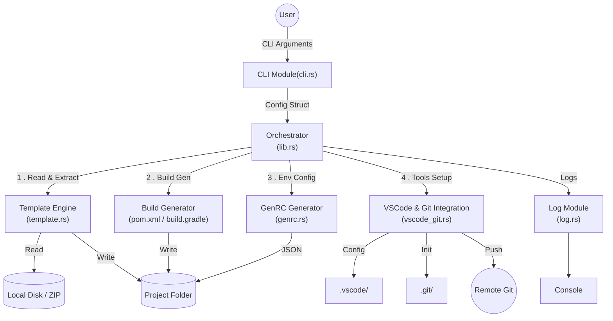
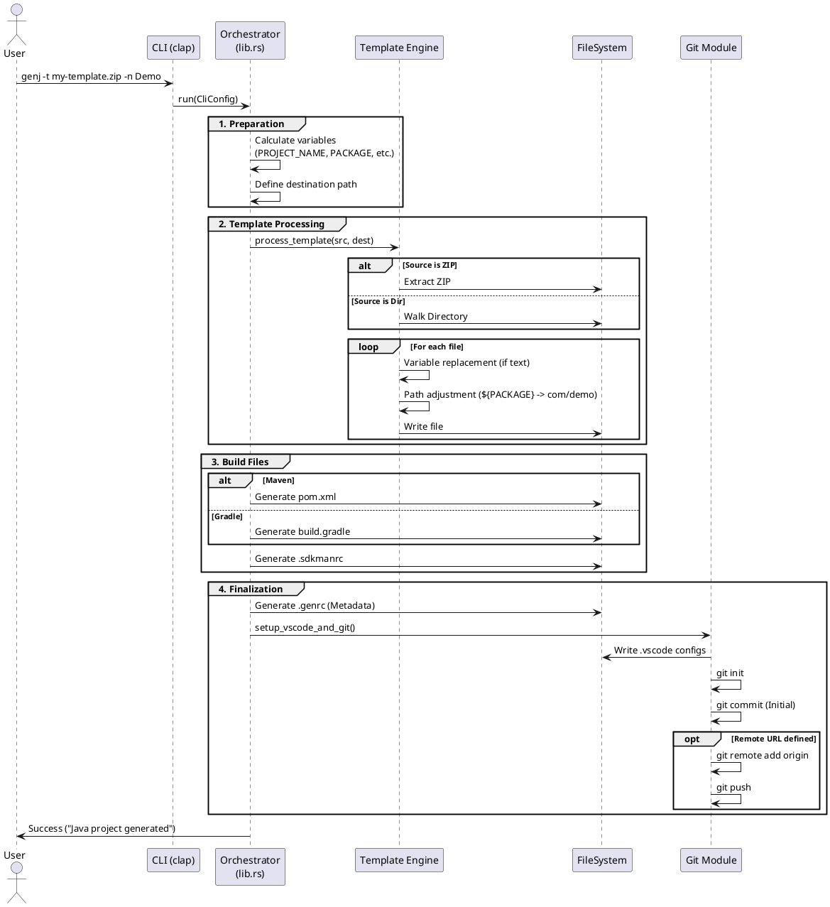

Here is the English translation of the architecture document. I have also translated the labels within the diagrams (
Mermaid and PlantUML) to ensure the visuals are consistent with the English text.

***

# Software Architecture Document: genj

## 1. Introduction

**genj** is a command-line interface (CLI) tool written in Rust, designed to quickly generate Java projects. It allows
for the creation of directory structures, copying of template files, replacement of dynamic variables, and configuration
of the development environment (VSCode, Git, build tools).

## 2. Architecture Overview

The architecture of `genj` is modular, centered around a linear execution flow triggered by the user command. The
application follows the typical "Input -> Process -> Output" model of CLI tools.

### Block Diagram

Here is a representation of the main modules and their interactions:

## 3. Component Description

### 3.1. User Interface (CLI)

* **Responsibility:** Parse arguments passed via the command line.
* **Implementation (`cli.rs`):** Uses the `clap` library to define flags and options (e.g., `--template`,
  `--java_version`, `--build`).
* **Output:** A `Cli` structure containing all the configuration necessary for execution.

### 3.2. Orchestrator (Core)

* **Responsibility:** Coordinate the generation steps.
* **Implementation (`lib.rs`, `run` function):** This is the core of the business logic. It defines the list of variable
  replacements (e.g., `${PROJECT_NAME}`, `${PACKAGE}`) and calls the other modules sequentially.

### 3.3. Template Engine

* **Responsibility:** Copy source files to the destination while applying transformations.
* **Implementation (`template.rs`):**
    * Supports two sources: a local directory or a ZIP archive.
    * **Binary Detection:** Uses `fs.rs` to check if a file is text or binary. Binary files are copied as-is; text files
      undergo variable replacement.
    * **Package Management:** Transforms the directory structure (e.g., `src/main/java/${PACKAGE}/App.java` becomes
      `src/main/java/com/demo/App.java`).

### 3.4. File System Configuration

* **Responsibility:** Abstraction for low-level operations.
* **Implementation (`fs.rs`):** Provides utilities to verify if a buffer is valid UTF-8 (`is_text_bytes`) and for safe
  file writing.

### 3.5. VSCode and Git Integration

* **Responsibility:** Prepare the development environment ("Developer Experience").
* **Implementation (`vscode_git.rs`):**
    * **VSCode:** Generates `settings.json` and `launch.json` tailored for the Java project.
    * **Git:** Initializes the local repository (`git init`), configures the user (name/email), creates the initial
      commit, and sets up the remote repository (`origin`) if a URL is provided.

### 3.6. Logging and Metadata

* **Logs (`log.rs`):** Centralized management of console outputs (Info, Verbose, Warning, Success).
* **GenRC (`genrc.rs`):** Creates a `.genrc` (JSON) file at the root of the generated project to keep track of
  parameters used during generation (useful for future updates or auditing).

## 4. Execution Flow (Sequence Diagram)

This diagram illustrates the call to the `genj` command and the sequence of internal operations.

## 5. Error Handling

The application uses Rust's `Result` type system. Errors are propagated from low-level functions (IO, ZIP, Git) up to
`main.rs`.

* If an error occurs (e.g., permission denied, template not found), the program stops and displays an explicit error
  message on `stderr`.
* The exit code is `1` in case of error, `0` in case of success.

## 6. Key Technical Points

* **Rust & Clap:** Native performance and robust argument handling.
* **`git2` Library:** Uses libgit2 (via Rust bindings) for Git operations, avoiding the need to have the `git`
  executable installed for initialization (although recommended for future usage).
* **Build Tool Agnostic:** The engine natively supports Maven and Gradle by dynamically generating the appropriate
  descriptors.