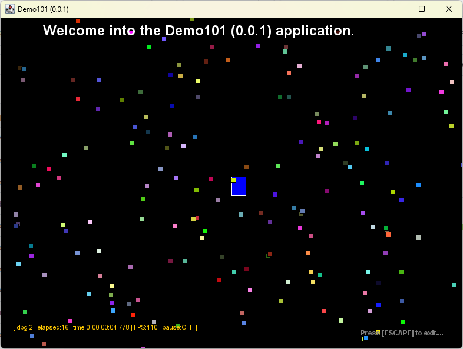

# README

This basic java project ${PROJECT_NAME} version ${PROJECT_VERSION} 
contains the ${MAINCLASS} class into the ${PACKAGE}.

## Project structure

## Screenshot

by ${AUTHOR_NAME} <${AUTHOR_EMAIL}>