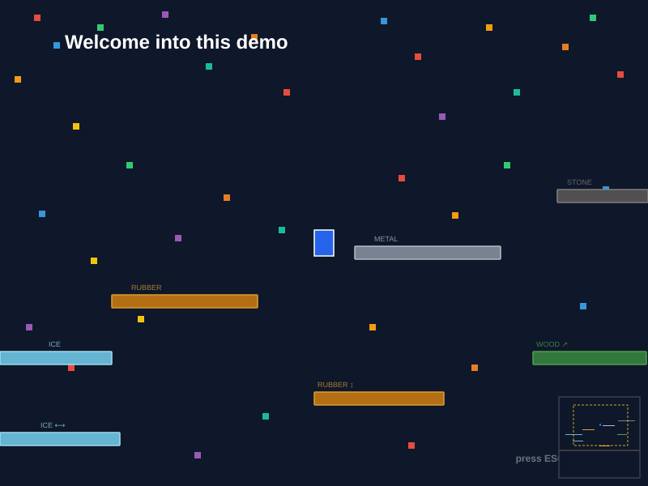

# GameEngineDemo


[](https://github.com/mcgivrer/GameEngineDemo/actions/workflows/ci-build.yml)
[](https://github.com/mcgivrer/GameEngineDemo/actions/workflows/ci-package.yml)

GameEngineDemo is a Java 2D demo application framework featuring a game loop, multi-camera rendering pipeline, entity system, behavior system, spatial indexing (QuadTree), and a lightweight 2D physics stack.

Author: Frédéric Delorme <fredericDOTdelormeATgmailDOTcom>

---

## Features

### Physics & Simulation
- `PhysicsEngine` — gravity, damping, world containment, per-frame collision pass
- `CollisionEngine` — AABB detection + mass-based elastic response
- `World` — configurable gravity, simulation bounds (physicsType `NONE`)
- `Material` — predefined physical profiles: DEFAULT, WOOD, METAL, RUBBER, ICE, STONE
- Physics types per entity: `NONE`, `STATIC`, `DYNAMIC`

### Rendering
- `Renderer` — triple-buffered Swing rendering via `BufferStrategy`
- Multi-camera support with independent viewport, zoom, and target tracking
- Unified render loop sorted by `renderPriority` (lower = drawn first)
- HUD bar in screen space (debug level, FPS, entity counters, game time)

### Scene & Entity System
- `Scene` interface + `BaseScene` with `setWorld()` and `CopyOnWriteArrayList` for thread-safe iteration
- `Entity<T>` generic base with fluent builder API, `renderPriority`, and behavior list
- `GameObject` — concrete subclass with shape, color, and material support
- `Camera` — entity-based, follows a target with world-clamped panning

### Behavior System
- `Behavior` interface: `update()`, `draw()`, `drawDebug()`
- Built-in behaviors: `HorizontalPatrolBehavior`, `VerticalPatrolBehavior`, `WaypointBehavior`, `PlayerInputBehavior`, `VisualDebugBehavior`
- `QuadTreeDebugBehavior` — attached automatically to `World` by `BaseScene.setWorld()`; renders the spatial-index grid when `debug > 3`

### Spatial Index
- `QuadTree` — AABB 2D spatial partitioning (configurable max items, max depth)
- Frustum culling: `scene.getVisibleEntities()` reduces draw calls to only on-screen entities
- `QuadTreeDebugOverlay` — depth-coded, fill-density overlay for spatial analysis

---

## Architecture Overview

```
DemoApp ─── Renderer ─── Camera(s)
   │              └─── render loop (sorted by renderPriority)
   ├── PhysicsEngine ── gravity / damping / containment
   ├── CollisionEngine ─ AABB pairs
   └── Scene (BaseScene)
         ├── World (renderPriority −100)
         │     └── QuadTreeDebugBehavior
         ├── Entity / GameObject …
         └── QuadTree (spatial index)
```

---

## DemoScene — Aperçu du rendu



> Vue simulée de la DemoScene à t=0 : caméra centrée sur le joueur (bleu), plateformes de différents matériaux (ICE, RUBBER, METAL, STONE, WOOD), objets dynamiques colorés, et minimap en bas à droite (rectangle jaune pointillé = frustum caméra).

---

## Documentation

Documentation hub: [src/docs/index.md](src/docs/index.md)

| # | Chapter |
|---|---|
| [00](src/docs/00-overview.md) | Global project overview and simulation pipeline |
| [01](src/docs/01-entity.md) | Entity component |
| [02](src/docs/02-gameobject.md) | GameObject component |
| [03](src/docs/03-physicsengine.md) | PhysicsEngine component |
| [04](src/docs/04-world.md) | World component |
| [05](src/docs/05-material.md) | Material component |
| [06](src/docs/06-collisionengine.md) | CollisionEngine component |
| [07](src/docs/07-build-packaging.md) | Build and OS packaging |
| [08](src/docs/08-testing.md) | Testing: JUnit 5 + Cucumber BDD |
| [09](src/docs/09-scene.md) | Scene system: lifecycle and configuration |
| [10](src/docs/10-behaviors.md) | Behavior system |
| [11](src/docs/11-spatial-index.md) | Spatial index and frustum culling |
| [12](src/docs/12-renderer.md) | Renderer and Camera |

SVG illustrations: [src/docs/illustrations](src/docs/illustrations)

---

## Build and Run

```bash
# Compile
mvn -B -ntp compile

# Tests (unit + Cucumber BDD)
mvn -B -ntp test

# Full build
mvn -B -ntp clean package -DskipTests

# Run via Maven
mvn -B -ntp exec:java

# Run directly
java --module-path target/classes -m com.demo/com.core.DemoApp
```

> Requires Java 25 (Zulu) and Maven 3.9.5. Use `sdk env` to activate the pinned versions from `.sdkmanrc`.

---

## CI and Packaging Workflows

GitHub Actions workflows included:

- Build: [ci-build.yml](.github/workflows/ci-build.yml)
- Packaging: [ci-package.yml](.github/workflows/ci-package.yml)

Packaging targets:

| OS | Format |
|---|---|
| Windows | EXE (via WiX) |
| Linux | DEB + RPM |
| macOS | DMG |
