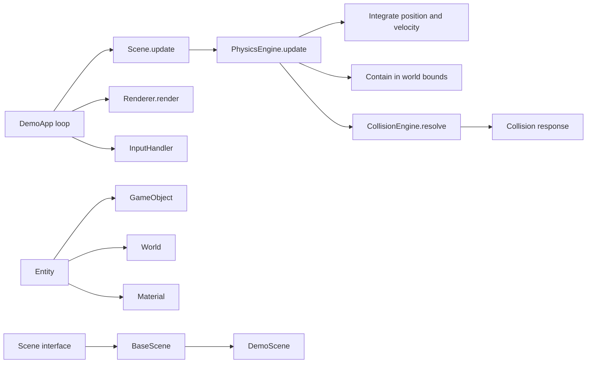
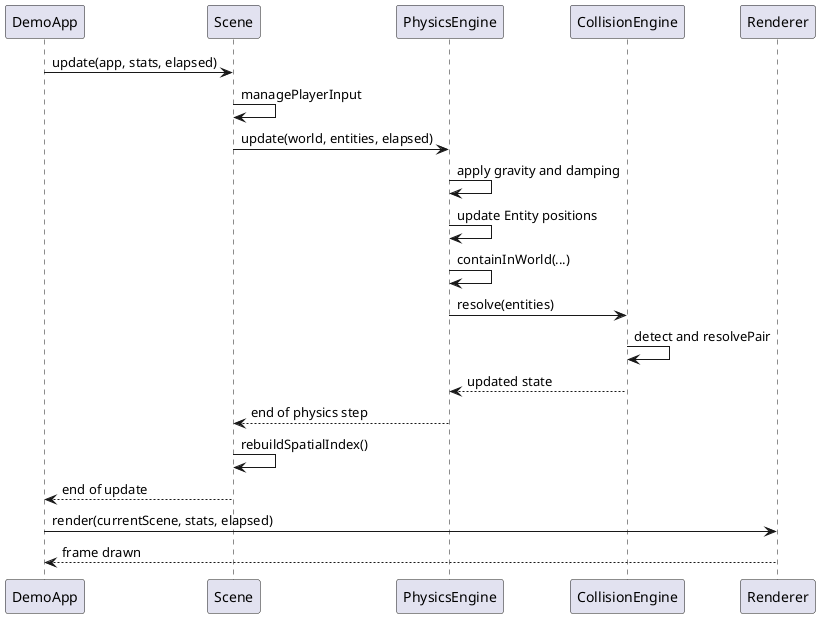

# 00 - Global Project Overview

## Functional Goal

GameEngineDemo is a 2D game foundation that combines:

- a game loop (update/render)
- scene management (lifecycle, configuration-driven loading)
- entity management
- simple physics simulation (gravity, collisions, world bounds containment)
- input handling and a rendering layer

The business objective is to evolve entities according to readable and extensible physics rules inside clearly separated scenes.

## Architecture Overview



## Source Layout

```
src/main/java/
├── module-info.java
└── com/
    ├── core/                         ← engine layer (reusable)
    │   ├── DemoApp.java              ← main entry point, game loop
    │   ├── entity/
    │   │   ├── Entity.java           ← generic base class for all simulation objects
    │   │   ├── GameObject.java       ← concrete Entity subclass for gameplay objects
    │   │   └── World.java            ← simulation bounds + gravity
    │   ├── gfx/
    │   │   └── Renderer.java         ← window creation and rendering
    │   ├── io/
    │   │   └── InputHandler.java     ← keyboard input management
    │   ├── physics/
    │   │   ├── CollisionEngine.java  ← AABB detection + mass-based elastic response
    │   │   ├── Material.java         ← physical material profiles + computeMass()
    │   │   ├── PhysicsEngine.java    ← gravity, damping, containment, collision pass
    │   │   └── PhysicsType.java      ← enum: NONE | STATIC | DYNAMIC
    │   ├── scene/
    │   │   ├── Scene.java            ← lifecycle interface
    │   │   └── BaseScene.java        ← default implementation with entity registry
    │   └── utils/
    │       ├── AppMode.java          ← enum: DEVELOPMENT | PRODUCTION
    │       ├── CircularQueue.java    ← fixed-size circular queue
    │       ├── Colors.java           ← color helpers
    │       └── TextAlign.java        ← text alignment enum
    └── demo/                         ← demo / game layer
        └── scenes/
            └── DemoScene.java        ← sample scene with physics objects
```

## Component Roles

| Class | Package | Role |
|---|---|---|
| `DemoApp` | `com.core` | Main entry point, game loop, scene/renderer/physics orchestration |
| `Entity` | `com.core.entity` | Base type for simulated and rendered objects |
| `GameObject` | `com.core.entity` | Direct Entity specialization for gameplay objects |
| `World` | `com.core.entity` | Simulation area plus gravity definition |
| `Renderer` | `com.core.gfx` | Window management and 2D rendering |
| `InputHandler` | `com.core.io` | Keyboard event collection and query |
| `Material` | `com.core.physics` | Physical properties (density, friction, elasticity) |
| `PhysicsEngine` | `com.core.physics` | Time integration and world boundary handling |
| `CollisionEngine` | `com.core.physics` | AABB detection and collision response |
| `PhysicsType` | `com.core.physics` | Enum: NONE, STATIC, DYNAMIC |
| `Scene` | `com.core.scene` | Lifecycle interface (load/create/update/unload) |
| `BaseScene` | `com.core.scene` | Default Scene implementation with entity registry |
| `QuadTree` | `com.core.spatial` | AABB spatial index — frustum culling for the renderer |
| `AppMode` | `com.core.utils` | Enum: DEVELOPMENT, PRODUCTION |
| `CircularQueue` | `com.core.utils` | Fixed-size circular queue utility |
| `Colors` | `com.core.utils` | Color helper utility |
| `DemoScene` | `com.demo.scenes` | Demo scene: player, physics boxes, ground |

## Physics Frame Cycle



## Illustrations


