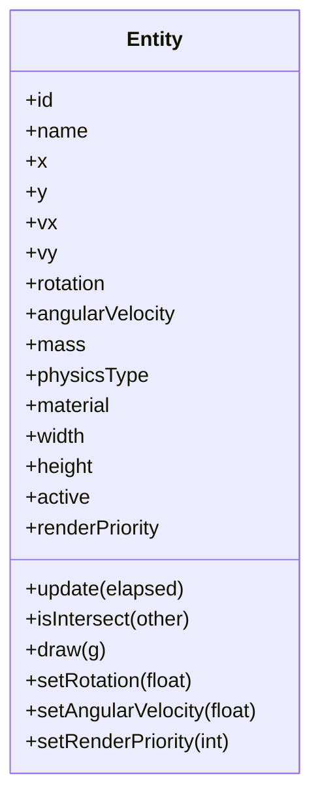

# 01 - Entity Component

**Package:** `com.core.entity`

## Functional Role

Entity is the core building block of the simulation. It stores:

- identity (`id`, `name`)
- kinematics (`x`, `y`, `vx`, `vy`, `rotation`, `angularVelocity`)
- physical data (`mass`, `physicsType`, `material`)
- rendering data (`width`, `height`, `color`, `fillColor`, `renderPriority`)

## Main API

- `setPosition`, `setVelocity`, `setSize`
- `setRotation(float)` — sets the current rotation angle in radians
- `setAngularVelocity(float)` — sets the rotational speed in radians/second
- `setPhysicsType`, `setMaterial`, `setMass`
- `setRenderPriority(int)` — controls draw order within a camera pass
- `update(elapsed)` to integrate position and rotation
- `isIntersect(other)` for AABB overlap testing

## Structure Diagram



## Render Priority

`renderPriority` controls the order in which entities are drawn within a single camera pass. Entities with a **lower** value are drawn first (appear behind entities with a higher value).

| Value | Convention |
|---|---|
| `−100` | `World` — always rendered first so World behaviors appear behind game objects |
| `0` | Default for all game objects |
| `> 0` | HUD-layer or foreground elements |

```java
entity.setRenderPriority(10);  // drawn after all default entities
world.setRenderPriority(-100); // drawn before everything (set by World constructor)
```

## Rotation

Two fields control the angular state of an entity:

| Field             | Type    | Unit     | Default | Description                                         |
|-------------------|---------|----------|---------|-----------------------------------------------------|
| `rotation`        | `float` | radians  | `0.0`   | Current orientation angle (integrated each frame)   |
| `angularVelocity` | `float` | rad/s    | `0.0`   | Rate of change of rotation (positive = CCW)         |

`rotation` is integrated in `update()` the same way position is integrated from velocity:

$$
\theta_{t+dt} = \theta_t + \omega \cdot dt
$$

Rotation is set via the fluent setters:

```java
entity.setRotation((float) Math.PI / 4);   // 45° initial angle
entity.setAngularVelocity(1.5f);           // 1.5 rad/s counter-clockwise
```

`PhysicsEngine` applies angular damping through `material.rotationalFriction` each frame, and `CollisionEngine` injects angular impulses on collision (see [PhysicsEngine](./03-physicsengine.md) and [CollisionEngine](./06-collisionengine.md)).

For `RECTANGLE` entities, rotation is additionally gated by a **tipping threshold** (see [PhysicsEngine — RECTANGLE tipping threshold](./03-physicsengine.md#rectangle-tipping-threshold)).

## Technical Notes

- `setMaterial(material)` recomputes mass through `computeMass(width, height)` when size is known.
- `update(elapsed)` applies simple explicit integration:

$$
x_{t+dt} = x_t + v_x \cdot dt \qquad y_{t+dt} = y_t + v_y \cdot dt \qquad \theta_{t+dt} = \theta_t + \omega \cdot dt
$$

## Related Illustration


