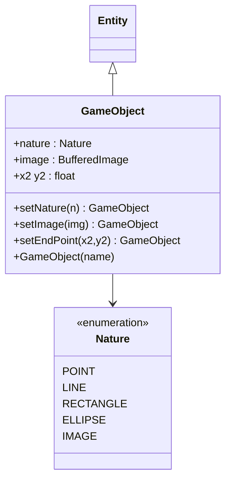

# 02 - GameObject Component

**Package:** `com.core.entity`

## Functional Role

GameObject is a lightweight specialization of Entity, intended for gameplay objects. It adds a **visual nature** (shape or image type) and the matching attributes needed for each shape.

## Diagram



## Nature

The `nature` field controls which renderer plugin is selected each frame.

| Nature | Shape drawn | Extra attributes |
|---|---|---|
| `POINT` | Filled circle, radius `max(2, width/2)` | — |
| `LINE` | Line segment from `(x,y)` to `(x2,y2)` | `x2`, `y2` |
| `RECTANGLE` | Filled/outlined rectangle *(default)* | — |
| `ELLIPSE` | Filled/outlined ellipse inscribed in bounding box | — |
| `IMAGE` | `BufferedImage` scaled to bounding box | `image` |

Default: `Nature.RECTANGLE` (backward-compatible).

### Fluent setters

```java
gameObject.setNature(Nature.ELLIPSE);            // explicit nature
gameObject.setImage(mySprite);                   // auto-sets nature=IMAGE
gameObject.setNature(Nature.LINE)
           .setEndPoint(400f, 300f);             // line endpoint
```

### Examples

```java
// Point
new GameObject("origin")
        .setPosition(100, 100)
        .setNature(Nature.POINT)
        .setColor(Color.RED);

// Line
new GameObject("horizon")
        .setPosition(0, 300)
        .setNature(Nature.LINE)
        .setEndPoint(800, 300)
        .setColor(Color.GREEN);

// Ellipse
new GameObject("ball")
        .setPosition(300, 300)
        .setSize(40, 40)
        .setNature(Nature.ELLIPSE)
        .setFillColor(Color.CYAN)
        .setColor(Color.WHITE);

// Image
BufferedImage sprite = ImageIO.read(getClass().getResourceAsStream("/img/player.png"));
new GameObject("player")
        .setPosition(200, 150)
        .setSize(32, 48)
        .setImage(sprite);   // nature=IMAGE set automatically
```

## Typical Usage

GameObjects are instantiated inside a `Scene.create()` implementation:

- player (`player`) — `DYNAMIC`, receives input forces each frame
- decorative or interactive elements (`box_*`) — `DYNAMIC`, driven by physics
- static surfaces (`ground`) — `STATIC`, acts as immovable collision target
- non-physical elements (`hud_marker`) — `PhysicsType.NONE`, ignored by physics

## Functional Impact

The Entity/GameObject split keeps the core generic and enables richer domain classes later (Player, Enemy, Pickup) without changing the physics engine.
