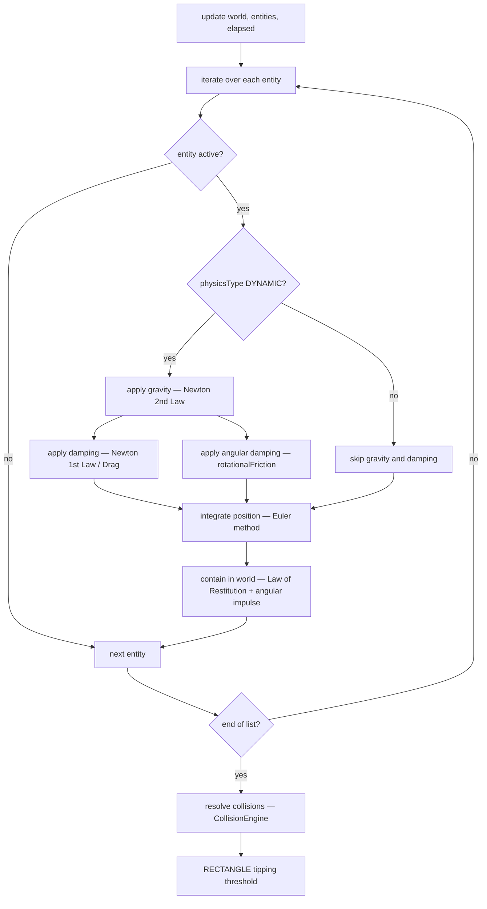
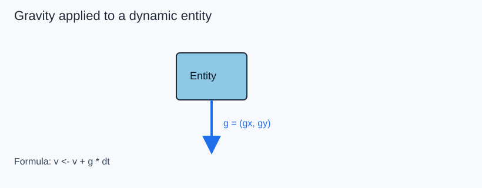
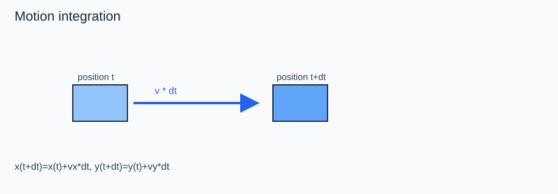
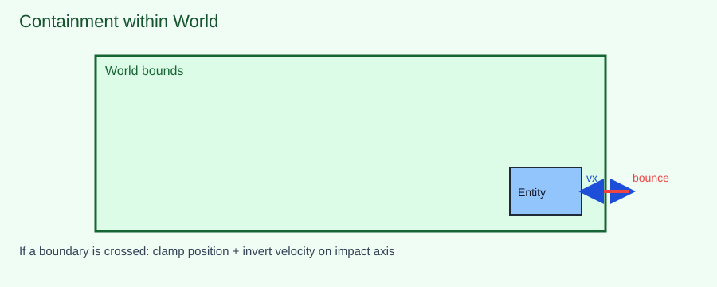
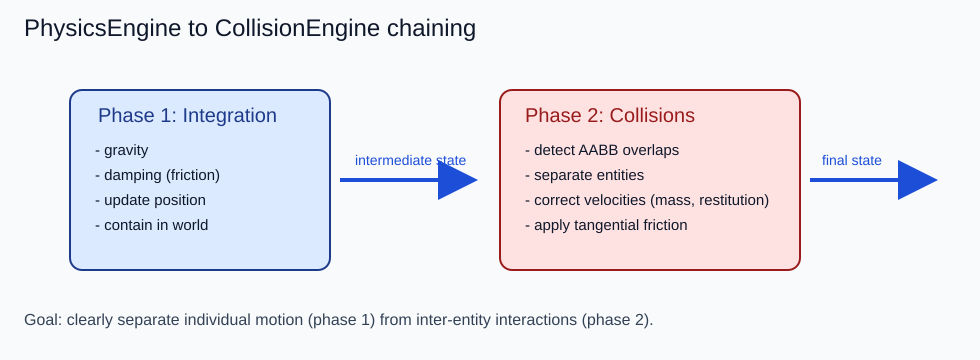

# 03 - PhysicsEngine Component

**Package:** `com.core.physics`

## Functional Role

`PhysicsEngine` is the central coordinator of the simulation loop. At each frame it advances the physical state of every active `DYNAMIC` entity by a sequence of deterministic steps, then delegates contact resolution to `CollisionEngine`.

Its responsibilities are deliberately narrow: it does **not** own entity state (that belongs to `Entity`) and it does **not** decide simulation geometry (that belongs to `World`). It only **drives** the state forward in time.

The five ordered steps performed each frame are:

1. **Apply accelerations** — add gravity contribution to velocity
2. **Apply damping** — attenuate linear velocity and angular velocity through material friction and rotational friction
3. **Integrate positions and rotation** — move and rotate each entity according to its current velocity and angular velocity
4. **Contain within world bounds** — clamp position, invert velocity at boundaries, and inject angular impulse from tangential impact
5. **Resolve collisions** — delegate pair-wise contact response to `CollisionEngine`, then enforce RECTANGLE tipping threshold

This ordering matters: positions must be integrated *before* containment, and containment must run *before* collision resolution, so that corrective impulses are applied on already-bounded positions.

`STATIC` entities participate only in step 5 (as passive collision targets). `NONE` entities are skipped entirely.

## Computation Pipeline

The pipeline executes once per call to `PhysicsEngine.update(world, entities, elapsed)`. The `elapsed` parameter carries the real wall-clock duration of the previous frame in milliseconds; it is immediately converted to seconds (`dt = elapsed / 1000.0`) so that all formulas are time-consistent regardless of frame rate.

**Stage 1 — Guard checks.** Before any computation the engine verifies that the entity is both `active` and of type `DYNAMIC`. Inactive entities (e.g. off-screen objects, pooled instances) and non-dynamic entities (walls, sensors) are skipped with zero cost.

**Stage 2 — Velocity integration (gravity + damping).** For each qualifying entity, gravitational acceleration is added to velocity components, then a damping factor derived from the material friction is applied multiplicatively to linear velocity, and a second damping factor derived from `material.rotationalFriction` is applied to `angularVelocity`. These sub-steps modify `vx`, `vy`, and `angularVelocity` in place.

**Stage 3 — Position and rotation integration.** `entity.update(elapsed)` is called, which performs a forward Euler step: position is advanced by `velocity × dt` and rotation is advanced by `angularVelocity × dt`. Delegating this call to `Entity` keeps the integration logic close to the data.

**Stage 4 — World containment.** `containInWorld` clamps the entity's bounding box to the world rectangle. When a boundary is exceeded, the relevant velocity component is negated and scaled by the material's restitution coefficient. Additionally, an angular impulse is injected from the tangential velocity component at the contact edge, so boundary bounces cause realistic spin.

**Stage 5 — Collision resolution + RECTANGLE tipping.** After all entities have been individually updated and contained, `CollisionEngine.resolve(entities)` scans all DYNAMIC–DYNAMIC and DYNAMIC–STATIC pairs and applies mass-weighted impulse corrections. After the collision pass, `PhysicsEngine` enforces the RECTANGLE tipping threshold (see below).

## Main Formulas

Let $dt = elapsed / 1000$.

### Gravity — Newton's Second Law (simplified)

In classical mechanics, Newton's Second Law states:

$$\vec{F} = m \cdot \vec{a}$$

For a uniform gravitational field, every body experiences the same acceleration $\vec{g}$ regardless of its mass (Galileo's equivalence principle, later formalized by Newton). This engine applies gravity directly as an acceleration, which is the standard simplification used in game physics:

$$
v_x \leftarrow v_x + g_x \cdot dt
$$
$$
v_y \leftarrow v_y + g_y \cdot dt
$$

where $g_x$ and $g_y$ are stored on the `World` instance in **pixels/second²**.

#### Gravity in m/s² — the PPM scale

The `World` class exposes two ways to configure gravity:

| Method | Unit | Example |
|---|---|---|
| `setGravity(gx, gy)` | px/s² (direct) | `setGravity(0f, 750f)` |
| `setGravityMs2(gx, gy)` | m/s² (real-world) | `setGravityMs2(0f, 15f)` |

`setGravityMs2` converts transparently using the **Pixels Per Metre** constant:

$$PPM = 50 \text{ px/m}$$

$$g_{px} = g_{m/s^2} \times PPM$$

So `setGravityMs2(0f, 15f)` stores $g_y = 15 \times 50 = 750$ px/s², while Earth's gravity would be $9.81 \times 50 \approx 490$ px/s².

The `DemoScene` uses **15 m/s²** (≈1.5× Earth) for a deliberately snappier platformer feel.

> **Reference — Newton's Second Law**: [Wikipedia — Newton's laws of motion](https://en.wikipedia.org/wiki/Newton%27s_laws_of_motion#Second_law) · [Wikipedia — Equations of motion](https://en.wikipedia.org/wiki/Equations_of_motion)

### Newton's First Law — Inertia

Newton's First Law states that a body in motion remains in motion at constant velocity unless acted upon by a net external force. In the absence of damping, the velocity fields `vx` and `vy` would propagate unchanged frame after frame. Damping models the real-world effect of drag and surface friction that continuously dissipate kinetic energy:

$$
damping = \max(0,\; 1 - friction \cdot 0.02)
$$
$$
v_x \leftarrow v_x \cdot damping \qquad v_y \leftarrow v_y \cdot damping
$$

> **Reference — Inertia and drag**: [Wikipedia — Newton's First Law](https://en.wikipedia.org/wiki/Newton%27s_laws_of_motion#First_law) · [Wikipedia — Drag (physics)](https://en.wikipedia.org/wiki/Drag_(physics))

### Position Integration — Euler method

Once velocity is known, position is advanced using a first-order forward Euler step (symplectic variant when velocity is updated before position, as done here):

$$
x \leftarrow x + v_x \cdot dt \qquad y \leftarrow y + v_y \cdot dt
$$

This is the discrete form of the kinematic equation $\vec{r}(t+dt) = \vec{r}(t) + \vec{v}(t) \cdot dt$.

> **Reference — Euler integration**: [Wikipedia — Euler method](https://en.wikipedia.org/wiki/Euler_method) · [Wikipedia — Symplectic Euler method](https://en.wikipedia.org/wiki/Semi-implicit_Euler_method)

### Boundary bounce — Newton's Law of Restitution

When an entity hits a world boundary, the component of velocity perpendicular to the wall is inverted and scaled by the coefficient of restitution $e \in [0, 1]$:

$$
v_{\perp}^{\,\prime} = -e \cdot v_{\perp}
$$

$e = 1$ is a perfectly elastic bounce (no energy loss); $e = 0$ is a perfectly inelastic collision (entity stops on impact). The tangential component is attenuated by friction.

> **Reference — Coefficient of restitution**: [Wikipedia — Coefficient of restitution](https://en.wikipedia.org/wiki/Coefficient_of_restitution) · [Wikipedia — Newton's law of restitution](https://en.wikipedia.org/wiki/Newton%27s_law_of_restitution)

## Material Data Source

The values used by PhysicsEngine for friction, density, and elasticity come from the Material instance referenced by each Entity.

- Reference model: [Entity](./01-entity.md)
- Material definition: [Material](./05-material.md)

In other words, each Entity carries a reference to a Material object, and PhysicsEngine uses that reference to read physical coefficients during simulation.

Practical impact:

1. friction drives damping and tangential energy loss
2. elasticity drives bounce/restitution behavior
3. density is used by Material to compute mass, which influences collision response

## Detailed Concept Walkthrough

### 1) Gravity: continuous acceleration

The engine applies a uniform acceleration to `DYNAMIC` entities.
In practice, gravity does not directly modify position; it modifies velocity.
This produces natural motion: as time progresses, vertical speed increases along the gravity direction.

This figure shows the gravity vector applied at each simulation step:

The gravity value stored on `World` is always in **pixels/second²**. It can be set directly via `setGravity(gx, gy)` or using the human-readable `setGravityMs2(gx, gy)` which multiplies the real-world m/s² value by `World.PPM` (50 px/m) before storing it.

Important note: `STATIC` and `NONE` entities do not receive this acceleration.

### 2) Motion integration: from velocity to position

Once velocity has been updated, PhysicsEngine calls `Entity.update(elapsed)`.
This step converts kinematic state into spatial displacement.

In practice:

- if `vx` increases, the entity moves faster on the X axis
- if `vy` increases, the entity moves faster on the Y axis
- the `dt` factor keeps behavior consistent even if frame time varies

Illustration of the transition from position `t` to position `t + dt`:

### 3) Damping and friction: energy dissipation

Damping applies a multiplicative coefficient derived from material friction.
It is not a full fluid simulation, but a simple and stable model to limit system energy.

Functional effect:

- high friction: speed decays faster
- low friction: inertia is more visible

### 4) World containment: bounds and bounce

After the position update, `containInWorld` checks that the entity stays within the world rectangle.
If an entity crosses a boundary:

1. position is clamped to the boundary
2. velocity on the impact axis is inverted with restitution
3. tangential velocity is attenuated by friction
4. an angular impulse is applied from the tangential velocity at the contact edge

#### Angular impulse on boundary bounce

When an entity bounces off a wall or floor, the tangential velocity at the contact edge generates a torque proportional to the entity's lever arm. The impulse is computed as:

$$
I = \frac{m(w^2 + h^2)}{12} \qquad \ell = \begin{cases} h/2 & \text{vertical wall} \\ w/2 & \text{floor or ceiling} \end{cases}
$$

$$
\omega \leftarrow \omega + \frac{v_{tangent} \cdot \ell \cdot friction}{I}
$$

where $friction$ is `material.friction` and $I$ is the rectangular moment of inertia. This step is handled by the helper method `applyBoundaryAngularImpulse(entity, tangentVel, friction, vertWall)`.

Illustration of world containment and bounce behavior:

### 5) Chaining with collision resolution

When all entities have been integrated and contained, PhysicsEngine delegates contact handling to `CollisionEngine.resolve(entities)`.
This two-step split provides a clear flow:

1. integrate individual motion
2. correct interactions between entities

This decoupling also helps future evolutions (additional forces, broad-phase, sub-steps).

After the collision pass, the engine applies the **RECTANGLE tipping threshold** (see below).

Illustration of the two-phase sequence:

---

## Angular Physics

### Angular damping

Each frame, `angularVelocity` is attenuated by a damping factor derived from `material.rotationalFriction`, analogous to how linear velocity is damped by `material.friction`:

$$
\omega \leftarrow \omega \cdot \max\!\bigl(0,\; 1 - rotationalFriction \cdot 0.02\bigr)
$$

High `rotationalFriction` (e.g. RUBBER = 0.80) causes spin to decay rapidly; low values (e.g. ICE = 0.02) preserve angular momentum for many frames.

### RECTANGLE tipping threshold

`RECTANGLE` entities are subject to a gravitational stability check after each collision pass. A box resting on a surface can only tip over if the resultant force is sufficient to overcome the gravitational restoring torque. In practice, this is expressed as a speed threshold:

$$
v_{tip} = |g_Y| \cdot \frac{w}{h}
$$

where $g_Y$ is the world gravity on the Y axis, $w$ is the entity width and $h$ is its height.

If the entity's resultant speed $\lVert\vec{v}\rVert \le v_{tip}$, the box cannot tip and `angularVelocity` is forced to zero:

$$
\text{if } \sqrt{v_x^2 + v_y^2} \leq v_{tip} \quad\Rightarrow\quad \omega \leftarrow 0
$$

This threshold only applies to `RECTANGLE` nature entities. `ELLIPSE`, `POINT`, and other natures rotate freely without this constraint.

> **Reference — Tipping / overturning stability**: [Wikipedia — Overturning moment](https://en.wikipedia.org/wiki/Overturning_moment)
