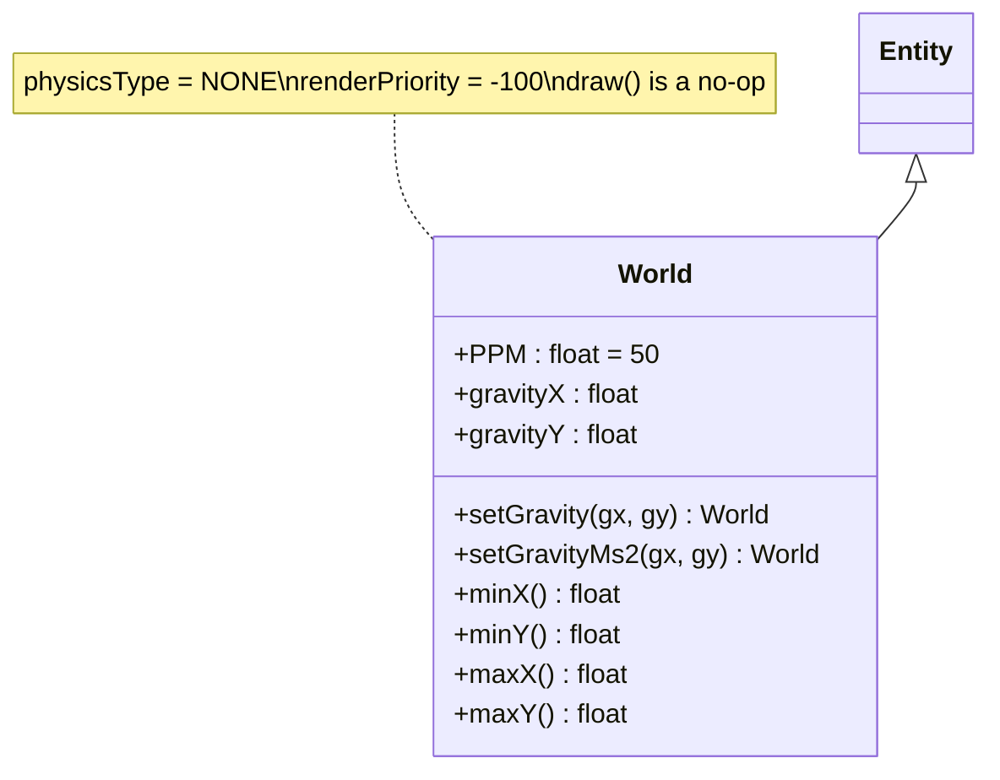

# 04 - World Component

**Package:** `com.core.entity`

## Functional Role

World defines the physical simulation space.

- inherits from Entity
- represents a bounded rectangle (`minX`, `maxX`, `minY`, `maxY`)
- carries the gravity vector (`gravityX`, `gravityY`) in **pixels/second²**
- is always the **first entity rendered** in its scene (`renderPriority = −100`), so any behavior attached to it (e.g. `QuadTreeDebugBehavior`) appears behind all game objects
- its `physicsType` is `NONE`: world boundaries are enforced by `PhysicsEngine.containInWorld()`, not by the AABB collision engine; this prevents `CollisionEngine` from resolving spurious overlaps between every entity and the world rectangle

## Diagram



## Gravity Configuration

Gravity is stored in pixels/second² on `gravityX` / `gravityY`. Two methods allow setting it:

### `setGravity(float gx, float gy)`

Sets gravity directly in px/s². Low-level, used by tests and internal code.

```java
world.setGravity(0f, 750f); // 750 px/s² downward
```

### `setGravityMs2(float gxMs2, float gyMs2)`

Sets gravity expressed in m/s², automatically converted to px/s² using the **PPM** constant (Pixels Per Metre):

$$g_{px/s^2} = g_{m/s^2} \times PPM \qquad PPM = 50 \text{ px/m}$$

```java
world.setGravityMs2(0f, 9.81f); // Earth gravity ≈ 490 px/s²
world.setGravityMs2(0f, 15f);   // DemoScene — 750 px/s², ~1.5× Earth
```

| Gravity (m/s²) | px/s² | Context |
|---|---|---|
| 1.62 | 81 | Moon |
| 9.81 | 490 | Earth |
| 15.0 | 750 | DemoScene (snappier feel) |
| 24.8 | 1240 | Jupiter |

## Expected Behavior

- Dynamic entities remain inside the world rectangle (enforced by `PhysicsEngine.containInWorld()`).
- `STATIC` entities act as immovable collision surfaces.
- `NONE` entities (including `World` itself) are ignored by `CollisionEngine`.

## Registration in a Scene

Do **not** assign `this.world` directly in `BaseScene.create()`. Use `setWorld()` instead:

```java
// ✗ do not do this
world = new World("world").setPosition(0, 0).setSize(800, 600);

// ✓ correct
setWorld(new World("world").setPosition(0, 0).setSize(800, 600));
```

`BaseScene.setWorld(World)` does three things automatically:
1. Assigns the `world` field.
2. Adds the `World` to the entity list so it participates in the render pipeline.
3. Attaches a `QuadTreeDebugBehavior` that draws the spatial-index grid when `debug > 3`.

## Illustration


