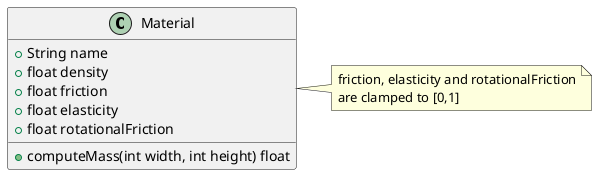
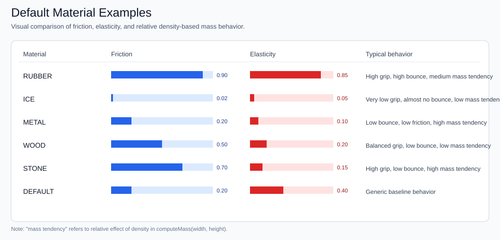
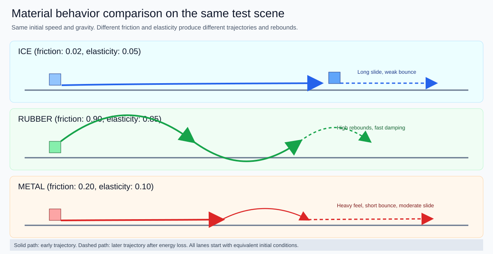

# 05 - Material Component

**Package:** `com.core.physics`

## Functional Role

Material describes an entity's physical properties:

- density
- friction
- elasticity
- rotational friction

These properties drive computed mass, linear damping, rotational damping, and collision response.

## Predefined Values

- DEFAULT
- WOOD
- METAL
- RUBBER
- ICE
- STONE

## Default Materials Reference Table

The following values come from the constants defined in the Material class.

| Material | Name value | Density | Friction | Elasticity | Rot. Friction |
|----------|------------|--------:|---------:|-----------:|--------------:|
| DEFAULT  | `default`  |    1.00 |     0.20 |       0.40 |          0.30 |
| WOOD     | `wood`     |    0.60 |     0.50 |       0.20 |          0.40 |
| METAL    | `metal`    |    2.70 |     0.20 |       0.10 |          0.15 |
| RUBBER   | `rubber`   |    1.10 |     0.90 |       0.85 |          0.80 |
| ICE      | `ice`      |    0.90 |     0.02 |       0.05 |          0.02 |
| STONE    | `stone`    |    2.40 |     0.70 |       0.15 |          0.50 |

## Constructors

```java
// Full constructor — explicit rotational friction
new Material(String name, float density, float friction, float elasticity, float rotationalFriction)

// Backward-compatible 4-arg constructor — rotationalFriction defaults to 0.3
new Material(String name, float density, float friction, float elasticity)
```

All coefficients (`friction`, `elasticity`, `rotationalFriction`) are clamped to **[0, 1]** at construction time.

## Mass Formula

Mass is derived from density and entity size:

$$
mass = max(0.1, density \cdot max(1,width) \cdot max(1,height) \cdot 0.01)
$$

## Diagram



## Functional Interpretation

| Property            | Effect                                                              |
|---------------------|---------------------------------------------------------------------|
| `density`           | Higher density → higher mass for same size                         |
| `friction`          | Higher friction → more linear energy dissipated per frame          |
| `elasticity`        | Higher elasticity → stronger bounce on collision or world boundary |
| `rotationalFriction`| Higher value → angular velocity decays faster each frame           |

### Rotational Friction

`rotationalFriction` is used by `PhysicsEngine` to apply an angular damping factor each frame, analogous to how `friction` damps linear velocity:

$$
\omega \leftarrow \omega \cdot \max(0,\; 1 - rotationalFriction \cdot 0.02)
$$

It also influences the angular impulse magnitude injected during boundary bounces and entity collisions (see [PhysicsEngine](./03-physicsengine.md) and [CollisionEngine](./06-collisionengine.md)).

Practical guidance:

- **ICE** (0.02): entities spin freely for a long time
- **RUBBER** (0.80): spin dampens very quickly
- **METAL** (0.15): moderate spin retention, realistic for dense objects

## Illustration Examples

The following illustration shows practical examples of default materials and their expected behavior profile (grip, bounce, and relative mass tendency).



The following scene compares entities with different materials under the same initial conditions, highlighting differences in sliding, damping, and bounce behavior.


