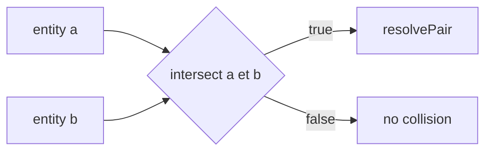
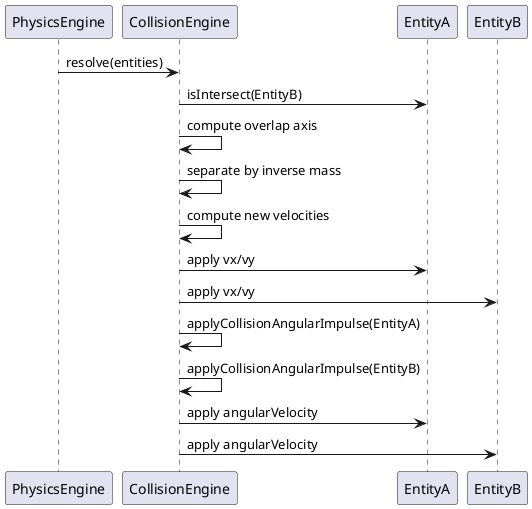
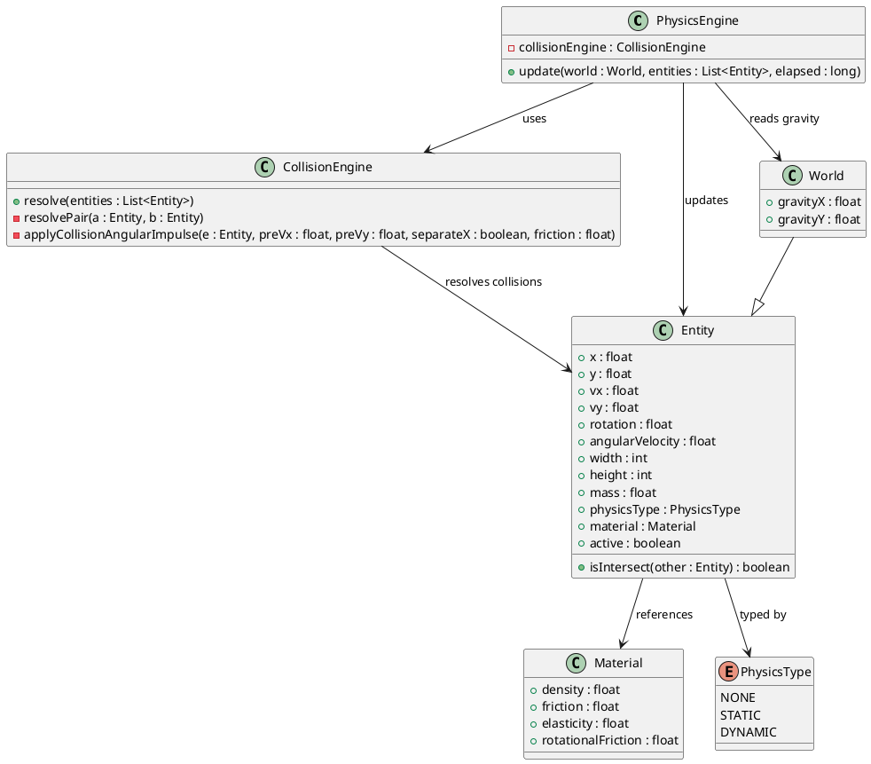
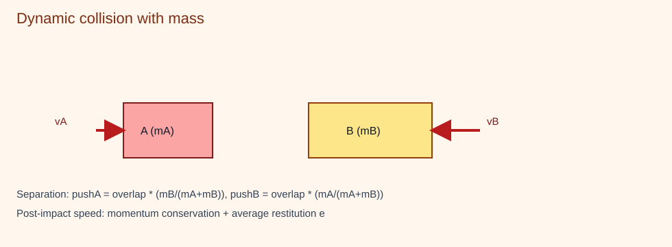

# 06 - CollisionEngine Component

**Package:** `com.core.physics`

## Functional Role

CollisionEngine detects AABB overlaps and applies collision response.

- detection: rectangle-rectangle overlap test (AABB)
- separation axis selection: smallest overlap (X or Y)
- type handling: DYNAMIC vs DYNAMIC, DYNAMIC vs STATIC, ignore NONE

## AABB Detection

## Mass-Based Response (DYNAMIC vs DYNAMIC)

1. Mass-weighted positional separation.
2. Velocity update with average restitution `e`.

1D formulas per axis:

$$
v'_a = \frac{(m_a - e m_b) v_a + (1 + e)m_b v_b}{m_a + m_b}
$$

$$
v'_b = \frac{(m_b - e m_a) v_b + (1 + e)m_a v_a}{m_a + m_b}
$$

Average friction reduces tangential velocity after impact.

### Angular Impulse on Collision

After resolving each pair's linear velocities, `CollisionEngine` injects an angular impulse on both entities via `applyCollisionAngularImpulse()`. The impulse is proportional to the change in tangential velocity at the contact edge:

$$
I = \frac{m(w^2 + h^2)}{12} \qquad \ell = \begin{cases} h/2 & \text{X-axis separation (vertical wall contact)} \\ w/2 & \text{Y-axis separation (horizontal contact)} \end{cases}
$$

$$
\omega \leftarrow \omega + \frac{v_{tangent,\,pre} \cdot \ell \cdot friction}{I}
$$

where $v_{tangent,\,pre}$ is the tangential velocity component **before** the collision response, $friction$ is the average of the two entities' `material.friction`, and $I$ is the rectangular moment of inertia.

This produces physically plausible spin: an entity hit from the side picks up rotation in the direction of the tangential impact force.

## Sequence Diagram

## Class Diagram (PlantUML)

## Illustration

