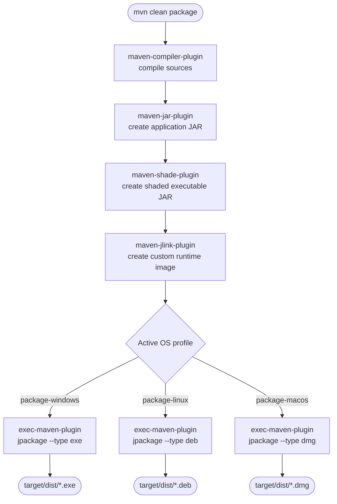

# 07 - Build and Packaging

## Scope

This chapter describes how GameEngineDemo is built, how distributable packages are produced, and how the CI workflows are aligned with the Maven configuration.

References:

- [Maven project configuration](../../pom.xml)
- [Build workflow](../../.github/workflows/ci-build.yml)
- [Package workflow](../../.github/workflows/ci-package.yml)

## Build Pipeline Overview

GameEngineDemo uses Maven with the following key plugins:

| Plugin                  | Version | Role                                                           |
|-------------------------|---------|----------------------------------------------------------------|
| `maven-compiler-plugin` | 3.13.0  | Compiles sources targeting Java 25                             |
| `maven-jar-plugin`      | 3.4.1   | Creates the application JAR with a `Main-Class` manifest entry |
| `maven-shade-plugin`    | 3.5.3   | Produces a self-contained shaded (fat) JAR                     |
| `maven-jlink-plugin`    | 3.2.0   | Generates a minimal custom Java runtime image                  |
| `exec-maven-plugin`     | 3.5.0   | Runs `jpackage` per OS inside packaging profiles               |
| `jacoco-maven-plugin`   | 0.8.13  | Instruments bytecode, generates instruction/branch coverage report |

### Key Maven properties

| Property                       | Value              | Purpose                                      |
|--------------------------------|--------------------|----------------------------------------------|
| `main.class`                   | `com.core.DemoApp` | Entry point for JAR manifest and jpackage    |
| `app.name`                     | `GameEngineDemo`       | Installer and application name               |
| `jpackage.dest`                | `target/dist`      | Output directory for OS installers           |
| `runtime.image.dir`            | `target/runtime`   | Output directory for the jlink runtime image |
| `maven.compiler.source/target` | `25`               | Java language level                          |

## Local Build Commands

### Compile only

```bash
mvn -B -ntp compile
```

### Full verification

```bash
mvn -B -ntp clean verify
```

### Build package artifacts

```bash
mvn -B -ntp clean package -DskipTests
```

## Runtime and Packaging Outputs

During `package`, Maven produces:

| Artifact        | Path                                              | Description                               |
|-----------------|---------------------------------------------------|-------------------------------------------|
| Application JAR | `target/GameEngineDemo-1.0.0.jar`                     | Standard JAR with `Main-Class` manifest   |
| Shaded JAR      | `target/GameEngineDemo-1.0.0.jar` (replaces original) | Fat JAR bundling all dependencies         |
| Runtime image   | `target/runtime/`                                 | Custom JRE with only the required modules |
| OS installer    | `target/dist/`                                    | EXE / DEB / DMG depending on the OS |

> The shade plugin replaces the original JAR (`shadedArtifactAttached=false`), so the fat JAR retains the standard artifact name.

## Packaging Pipeline Diagram



## Cross-Platform Packaging Strategy

Packaging is controlled by Maven profiles activated automatically by the OS. Each profile invokes `jpackage` via `exec-maven-plugin` during the `package` phase with the following common arguments:

```
--name        GameEngineDemo
--app-version 1.0.0
--input       target/
--main-jar    GameEngineDemo-1.0.0.jar
--main-class  com.demo.DemoApp
--dest        target/dist
```

Windows and Linux additionally pass `--runtime-image target/maven-jlink/classifiers/runtime` to embed the trimmed JRE built by `maven-jlink-plugin`. The macOS profile omits `--runtime-image`: macOS `jpackage` expects a JDK bundle structure that a flat `jlink` image does not provide, so `jpackage` bundles the current JDK from `JAVA_HOME` instead.

The `--type` argument changes per profile:

| Profile           | OS activation    | Type  | Output file                                    |
|-------------------|------------------|-------|------------------------------------------------|
| `package-windows` | `family=Windows` | `exe` | `target/dist/GameEngineDemo-1.0.0.exe`         |
| `package-linux`   | `name=Linux`     | `deb` | `target/dist/GameEngineDemo_1.0.0-1_amd64.deb` |
| `package-macos`   | `family=mac`     | `dmg` | `target/dist/GameEngineDemo-1.0.0.dmg`         |

All profiles are auto-activated by Maven OS detection. No `-P` flag is needed.

## Packaging Prerequisites by OS

### Windows (EXE)

- WiX Toolset installed and available in PATH
- JDK including `jpackage`

### Linux (DEB)

- `fakeroot` installed
- JDK including `jpackage`

### macOS (DMG)

- JDK including `jpackage`
- Native packaging utilities available on macOS runner/host

## CI Integration

### Build workflow

The build workflow in [ci-build.yml](../../.github/workflows/ci-build.yml):

1. checks out source code
2. sets up Java 25
3. runs `mvn clean verify`
4. uploads JAR artifacts

### Packaging workflow

The packaging workflow in [ci-package.yml](../../.github/workflows/ci-package.yml):

1. Uses a matrix strategy — one job per platform (Windows, Linux, macOS), all running in parallel with `fail-fast: false`
2. Installs platform-specific prerequisites (WiX on Windows, fakeroot on Linux)
3. Runs `mvn -B -ntp clean package -DskipTests` — Maven auto-activates the correct OS profile
4. Uploads the generated installer from `target/dist/` as a workflow artifact
5. On tag pushes (`v*`), a `release` job downloads all three installers and publishes a GitHub Release with auto-generated notes

Triggered by: tag push (`v*`) or manual `workflow_dispatch`.

## Troubleshooting

- If EXE generation fails on Windows, verify WiX installation.
- If DEB generation fails on Linux, verify `fakeroot` is installed.
- If no installer is uploaded, inspect `target/dist` and Maven profile activation logs.
- Ensure `jpackage` is available from the JDK used by Maven.
