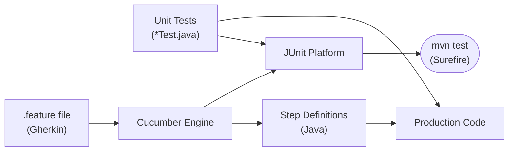
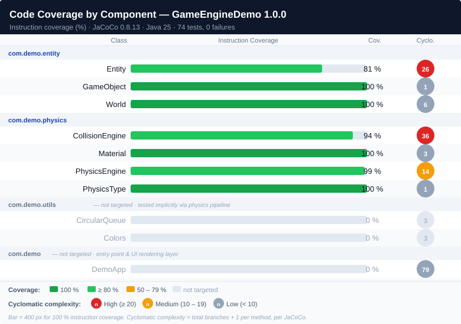

# 08 - Testing: Cucumber BDD and JUnit 5

## Overview

GameEngineDemo uses a **TDD/BDD** approach at two levels:

> **Test-Driven Development (TDD)** is a software development process in which tests are written before production code. The cycle is _red → green → refactor_. See [Martin Fowler — Test Driven Development](https://martinfowler.com/bliki/TestDrivenDevelopment.html) and [Wikipedia — Test-driven development](https://en.wikipedia.org/wiki/Test-driven_development).
>
**Behaviour-Driven Development (BDD)** extends TDD by expressing tests as human-readable scenarios in a structured language (Gherkin). See [Martin Fowler — BDD](https://martinfowler.com/bliki/BehaviorDrivenDevelopment.html) and [Wikipedia — Behavior-driven development](https://en.wikipedia.org/wiki/Behavior-driven_development).
>
| Level         | Tool                        | What is tested                                                                 |
|---------------|-----------------------------|--------------------------------------------------------------------------------|
| Unit tests    | JUnit Jupiter (JUnit 5)     | Individual classes in isolation (Entity, GameObject, Material, World)          |
| BDD scenarios | Cucumber 7 + JUnit Platform | Component behaviour through Gherkin scenarios (PhysicsEngine, CollisionEngine) |



## Test Strategy

The choice between a JUnit unit test and a Cucumber BDD scenario is driven by the nature of the contract being verified.

- **JUnit unit tests** target classes whose contracts are self-contained: constructor invariants, field defaults, clamping rules, fluent setter chains, value-formula correctness, and basic geometry. They are fast, isolated, and require no collaborators.
- **Cucumber BDD scenarios** target components that orchestrate several objects together — `PhysicsEngine` and `CollisionEngine` — where the expected behaviour is most clearly expressed as an observable outcome (position, velocity) from a known initial state after one simulation step. Gherkin makes these scenarios readable by non-developers.

This split keeps unit tests narrowly focused on each class's internal contract and reserves Gherkin scenarios for stakeholder-facing behavioural specifications of the physics pipeline.

| Component | Package | Test level | Rationale |
|---|---|---|---|
| `Entity` | `com.core.entity` | JUnit unit | Pure data class; contracts are field invariants and AABB geometry |
| `GameObject` | `com.core.entity` | JUnit unit | Thin subclass; verifies inheritance, defaults, and fluent chain |
| `Material` | `com.core.physics` | JUnit unit | Value object; clamping rules and mass formula correctness |
| `World` | `com.core.entity` | JUnit unit | Entity subclass; default type, gravity accessor, derived bounds |
| `PhysicsEngine` | `com.core.physics` | Cucumber BDD | Drives the full update pipeline; requires world + entities |
| `CollisionEngine` | `com.core.physics` | Cucumber BDD | Requires two interacting entities; outcome is positional and velocity change |

## Project Structure

```
src/
├── main/java/
│   ├── module-info.java
│   └── com/
│       ├── core/
│       │   ├── DemoApp.java
│       │   ├── entity/
│       │   │   ├── Entity.java
│       │   │   ├── GameObject.java
│       │   │   └── World.java
│       │   ├── gfx/
│       │   │   └── Renderer.java
│       │   ├── io/
│       │   │   └── InputHandler.java
│       │   ├── physics/
│       │   │   ├── CollisionEngine.java
│       │   │   ├── Material.java
│       │   │   ├── PhysicsEngine.java
│       │   │   └── PhysicsType.java
│       │   ├── scene/
│       │   │   ├── Scene.java
│       │   │   └── BaseScene.java
│       │   └── utils/
│       │       ├── AppMode.java
│       │       ├── CircularQueue.java
│       │       ├── Colors.java
│       │       └── TextAlign.java
│       └── demo/
│           └── scenes/
│               └── DemoScene.java
└── test/
    ├── java/com/demo/
    │   ├── EntityTest.java              ← unit tests for Entity
    │   ├── GameObjectTest.java          ← unit tests for GameObject
    │   ├── MaterialTest.java            ← unit tests for Material
    │   ├── WorldTest.java               ← unit tests for World
    │   ├── CucumberTestSuite.java       ← JUnit Platform Suite runner
    │   └── steps/
    │       ├── PhysicsEngineSteps.java  ← step definitions for PhysicsEngine
    │       └── CollisionEngineSteps.java← step definitions for CollisionEngine
    └── resources/
        ├── junit-platform.properties
        └── features/
            ├── physics_engine.feature
            └── collision_engine.feature
```

## Dependencies (`pom.xml`)

| Dependency                       | Version | Role                                         |
|----------------------------------|---------|----------------------------------------------|
| `junit-jupiter`                  | 5.11.0  | JUnit 5 engine, assertions, annotations      |
| `cucumber-java`                  | 7.20.1  | Gherkin step binding via annotations         |
| `cucumber-junit-platform-engine` | 7.20.1  | Bridges Cucumber with JUnit Platform         |
| `junit-platform-suite`           | 1.11.0  | `@Suite` runner discovered by Surefire       |
| `maven-surefire-plugin`          | 3.5.2   | Runs `*Suite` classes in addition to `*Test` |
| `jacoco-maven-plugin`            | 0.8.13  | Instruction and branch coverage report (build plugin, not a dependency) |

## Suite Runner

`CucumberTestSuite.java` is the single entry point discovered by Surefire:

```java
@Suite
@IncludeEngines("cucumber")
@SelectClasspathResource("features")      // scans src/test/resources/features/
@ConfigurationParameter(
    key   = Constants.GLUE_PROPERTY_NAME,
    value = "com.demo.steps"              // package containing step definitions
)
@ConfigurationParameter(
    key   = Constants.PLUGIN_PROPERTY_NAME,
    value = "pretty"                      // human-readable console output
)
public class CucumberTestSuite {}
```

`junit-platform.properties` completes the configuration:

```properties
cucumber.publish.quiet=true
cucumber.junit-platform.naming-strategy=long   # uses full scenario name in reports
```

## Writing a Feature File

Feature files are plain text with a `.feature` extension stored in `src/test/resources/features/`.

**Gherkin** is the domain-specific language used to write Cucumber scenarios. Its keywords (`Feature`, `Scenario`, `Given`, `When`, `Then`, `And`, `But`, `Background`) are designed to be readable by non-technical stakeholders. See [Wikipedia — Cucumber (software)](https://en.wikipedia.org/wiki/Cucumber_(software)) and [Martin Fowler — GivenWhenThen](https://martinfowler.com/bliki/GivenWhenThen.html).
>
### Structure

```gherkin
Feature: <name of the component under test>

  Background:               # optional – steps run before every scenario
    Given …

  Scenario: <what is being verified>
    Given <initial state>
    When  <action>
    Then  <expected outcome>
    And   <additional assertion>
```

### Example — `physics_engine.feature`

```gherkin
Feature: PhysicsEngine

  Background:
    Given a world of size 800x600 with gravity (0.0, 200.0)

  Scenario: Gravity accelerates a dynamic entity
    Given a dynamic entity at position (100.0, 100.0) with size 20x20 and velocity (0.0, 0.0)
    When the physics engine updates for 100 milliseconds
    Then the entity velocity Y should be greater than 0.0

  Scenario: A static entity is not accelerated by gravity
    Given a static entity at position (100.0, 100.0) with size 20x20 and velocity (0.0, 0.0)
    When the physics engine updates for 100 milliseconds
    Then the entity velocity Y should equal 0.0
```

### Naming rules

Because step text may contain coordinates in parentheses such as `(0.0, 200.0)`, Cucumber Expressions cannot be used — the parentheses are interpreted as optional groups. **Use regular expressions** instead:

```java
// ✗ Cucumber Expression – crashes when text contains (…)
@Given("a world with gravity ({double}, {double})")

// ✓ Regex – parentheses are escaped, parameters are capturing groups
@Given("^a world of size (\\d+)x(\\d+) with gravity \\((-?[\\d.]+), (-?[\\d.]+)\\)$")
```

## Writing Step Definitions

Each step in a `.feature` file must be matched by exactly one annotated method in a class inside the `com.demo.steps` package (the glue path).

### Anatomy of a step class

```java
public class PhysicsEngineSteps {

    // State shared within a scenario
    private World world;
    private GameObject entity;
    private final PhysicsEngine physicsEngine = new PhysicsEngine();

    // ── Given ─────────────────────────────────────────────────────────────────
    @Given("^a world of size (\\d+)x(\\d+) with gravity \\((-?[\\d.]+), (-?[\\d.]+)\\)$")
    public void aWorldWithGravity(int w, int h, double gx, double gy) {
        world = new World("test-world");
        world.setSize(w, h);
        world.setGravity((float) gx, (float) gy);
    }

    // ── When ──────────────────────────────────────────────────────────────────
    @When("the physics engine updates for {int} milliseconds")
    public void physicsEngineUpdates(int ms) {
        physicsEngine.update(world, List.of(entity), ms);
    }

    // ── Then ──────────────────────────────────────────────────────────────────
    @Then("the entity velocity Y should be greater than {double}")
    public void velocityYGreaterThan(double expected) {
        Assertions.assertTrue(entity.vy > (float) expected,
            "Expected vy > " + expected + " but was " + entity.vy);
    }
}
```

### Key rules

| Rule                                                      | Reason                                                          |
|-----------------------------------------------------------|-----------------------------------------------------------------|
| One step definition class per production class under test | Keeps glue code focused and easy to navigate                    |
| Fields are reset between scenarios automatically          | Cucumber creates a new instance of each step class per scenario |
| Use `Assertions.*` from JUnit 5                           | Provides descriptive failure messages                           |
| Cast `double` parameters to `float` before comparing      | The physics engine uses `float` internally                      |
| Prefix step text regex with `^` and suffix with `$`       | Prevents accidental partial matches                             |

## Scenario Coverage

### `physics_engine.feature`

`PhysicsEngine` is tested at BDD level because its observable contract spans several collaborators: a `World` supplying gravity and bounds, one or more `GameObject` instances, and the engine itself. A Gherkin scenario makes the causal chain explicit — *given* this world and entity state, *when* the engine runs for N milliseconds, *then* the resulting velocity or position satisfies this condition — without requiring the reader to understand the Java implementation. The eight scenarios below cover the four `PhysicsType` branches and all four containment boundaries.

| Scenario                              | What is verified                                             |
|---------------------------------------|--------------------------------------------------------------|
| Gravity accelerates a dynamic entity  | `vy` increases after one update tick                         |
| A static entity is not accelerated    | `STATIC` type ignores gravity                               |
| A NONE-type entity is skipped         | `NONE` type is entirely bypassed                             |
| An inactive entity is not processed   | `active = false` guards the update loop                      |
| Entity constrained at bottom boundary | `containInWorld` clamps `y + height ≤ maxY`                  |
| Entity bounces off right boundary     | `containInWorld` inverts `vx` and clamps `x + width ≤ maxX`  |
| Entity bounces off left boundary      | `containInWorld` inverts `vx` and clamps `x ≥ minX`          |
| Entity bounces off top boundary       | `containInWorld` inverts `vy` and clamps `y ≥ minY`           |

### `collision_engine.feature`

`CollisionEngine` is tested at BDD level because a collision response necessarily involves two entities and a measurable positional or velocity outcome. Expressing this in Gherkin makes the expected physical behaviour explicit and reviewable without reading Java source. The ten scenarios cover the main code paths: no overlap, dynamic–dynamic X and Y separation, dynamic–static and static–dynamic elastic bounce on both axes, mass-asymmetry displacement, and guard conditions (inactive entity, NONE-type entity).

| Scenario                                              | What is verified                                              |
|-------------------------------------------------------|---------------------------------------------------------------|
| Non-overlapping entities are not affected             | No state change when AABB gap exists                          |
| Two overlapping dynamic entities are separated (X)    | Mass-weighted positional push and velocity exchange on X axis |
| A dynamic entity bounces off a static entity (X)      | `DYNAMIC-STATIC` X: velocity inverted, static unchanged       |
| Heavier entity displaces lighter entity more          | Mass asymmetry in positional separation formula               |
| Two overlapping dynamic entities are separated (Y)    | Mass-weighted positional push and velocity exchange on Y axis |
| A dynamic entity bounces off a static entity (Y)      | `DYNAMIC-STATIC` Y: velocity inverted, static unchanged       |
| A static entity A deflects a dynamic entity B (Y)     | `STATIC-DYNAMIC` Y: only B deflected upward                   |
| A static entity A deflects a dynamic entity B (X)     | `STATIC-DYNAMIC` X: only B deflected along X                  |
| An inactive entity B is skipped                       | `active = false` on B prevents collision resolution           |
| A NONE-type entity B is skipped                       | `PhysicsType.NONE` on B prevents collision resolution         |

## Running the Tests

### Command line

```bash
# Run all tests (unit + Cucumber)
mvn -B -ntp test
```

### Expected output

```log
[INFO] Running com.demo.EntityTest
[INFO] Tests run: 14, Failures: 0, Errors: 0, Skipped: 0
[INFO] Running com.demo.GameObjectTest
[INFO] Tests run: 5, Failures: 0, Errors: 0, Skipped: 0
[INFO] Running com.demo.MaterialTest
[INFO] Tests run: 9, Failures: 0, Errors: 0, Skipped: 0
[INFO] Running com.demo.WorldTest
[INFO] Tests run: 9, Failures: 0, Errors: 0, Skipped: 0
[INFO] Running com.demo.CucumberTestSuite
[INFO] Tests run: 10, Failures: 0, Errors: 0, Skipped: 0
```

---

## Code Coverage

### Strategy: target complexity, not volume

Code coverage is a _means_, not a goal. Pursuing 100 % coverage on every class wastes effort on trivial getters and enum constants while potentially leaving the most error-prone logic under-tested. The productive approach is to correlate coverage investment with **cyclomatic complexity**: the higher the number of independent paths through a component, the greater the value of covering those paths.

In GameEngineDemo, the complexity distribution is highly uneven:

| Component | Cyclomatic complexity | Why |
|---|---:|---|
| `DemoApp` | 79 | GUI event loop, rendering branches, key handlers — intentionally excluded |
| `CollisionEngine` | 36 | AABB detection, two-axis separation, three physics-type combinations |
| `Entity` | 26 | Fluent setters with null guards, AABB geometry, update integration |
| `PhysicsEngine` | 14 | Four-stage pipeline, guard conditions per entity type |
| `World` | 6 | Gravity, bounds derivation |
| `Material` | 3 | Constructor clamping, mass formula |
| Others | ≤ 3 | Simple data classes or utility helpers |

The strategy applied here:

- `DemoApp` is **deliberately excluded**. It is a rendering and event-handling entry point whose correctness is validated by running the application, not by unit or BDD tests. Its complexity is high but domain-specific and UI-bound.
- `CollisionEngine` and `PhysicsEngine` are covered at **BDD level**. Their pipelines involve multiple collaborators and their correctness is best expressed as observable physical outcomes.
- `Entity`, `World`, `Material`, and `GameObject` are covered at **unit-test level**. They are self-contained and their contracts are field invariants, formula results, and fluent return types.
- `CircularQueue` and `Colors` are **utility helpers** with low complexity (3 each). They are exercised implicitly by the physics pipeline and do not warrant dedicated test classes.

> The rule of thumb: write dedicated tests for components with cyclomatic complexity ≥ 5 **or** components that implement a domain contract expressible as a stakeholder scenario.

### Tool: JaCoCo

Coverage is measured by **JaCoCo 0.8.13**, configured in `pom.xml` via `jacoco-maven-plugin`. It instruments the bytecode at test time and generates an HTML + CSV report automatically during `mvn test`.

```bash
# Run tests and generate coverage report in one step
mvn -B -ntp test

# HTML report
open target/site/jacoco/index.html
```

The report is produced in `target/site/jacoco/`. The CSV variant (`jacoco.csv`) provides per-class instruction and branch counts that feed the illustration below.

### Current coverage snapshot

The illustration below shows instruction coverage (%) and cyclomatic complexity per class, grouped by package. Classes with no dedicated tests are shown in grey.



| Class | Package | Instruction coverage | Branch coverage | Complexity |
|---|---|---:|---:|---:|
| `Entity` | `com.demo.entity` | 81 % | 94 % | 26 |
| `GameObject` | `com.demo.entity` | 100 % | 100 % | 1 |
| `World` | `com.demo.entity` | 100 % | 100 % | 6 |
| `CollisionEngine` | `com.demo.physics` | 94 % | 79 % | 36 |
| `Material` | `com.demo.physics` | 100 % | 100 % | 3 |
| `PhysicsEngine` | `com.demo.physics` | 99 % | 91 % | 14 |
| `PhysicsType` | `com.demo.physics` | 100 % | 100 % | 1 |
| `CircularQueue` | `com.demo.utils` | 0 % | 0 % | 3 — not targeted |
| `Colors` | `com.demo.utils` | 0 % | 0 % | 3 — not targeted |
| `DemoApp` | `com.demo` | 0 % | 0 % | 79 — entry point, not targeted |

### Coverage gaps and improvement areas

All targeted classes now exceed the 80 % instruction threshold. The remaining gaps are in areas that are either intentionally excluded or impractical to test in isolation:

**`Entity` (81 % instruction, 94 % branch)** — the one remaining uncovered branch is inside `setMaterial`: the case where `material != null`, `width > 0`, but `height == 0`. This scenario requires explicitly constructing a zero-height entity, which is not a valid simulation object and would only arise from programmer error. The rendering method (`draw`) and all other paths are now covered.

**`CollisionEngine` (94 % instruction, 79 % branch)** — the remaining uncovered branches are the STATIC-STATIC pair (skipped by design — two immovable objects produce no physical response) and boundary conditions where the X and Y overlaps are exactly equal, making the axis-selection branch degenerate.

**`PhysicsEngine` (99 % instruction, 91 % branch)** — the single uncovered branch is the `material == null` fallback restitution/friction path inside `containInWorld`. This is unreachable under normal conditions because all `GameObject` instances are constructed with a non-null `Material`.

---

## Unit Tests

### Why unit tests alongside Cucumber?

Cucumber scenarios are ideal for **behaviour** expressed at component level (what the engine does). Unit tests target **implementation contracts**: edge cases, return types, field values, clamping rules — things that would be too verbose to express in Gherkin.

| Use Cucumber when…                                    | Use JUnit unit tests when…                                     |
|-------------------------------------------------------|----------------------------------------------------------------|
| Testing a flow involving multiple collaborators       | Testing a single class in isolation                            |
| The test can be expressed as a user-readable scenario | Testing internal invariants, edge values, or constructor logic |
| The team includes non-developers who read specs       | Testing fluent-setter return types or clamped values           |

### Rules for writing unit tests

| Rule                                                                   | Rationale                                                           |
|------------------------------------------------------------------------|---------------------------------------------------------------------|
| One `*Test.java` class per production class                            | Direct 1-to-1 traceability                                          |
| Use `@Nested` classes to group related tests                           | Produces a readable tree in IDE and Surefire reports                |
| Use `@DisplayName` on every class and method                           | Makes the failure message self-explanatory without reading the code |
| Use `@BeforeEach` to reset shared state                                | Avoids test-order dependencies                                      |
| Name tests as a readable sentence: _"method / scenario / expectation"_ | Clarifies intent without comments                                   |
| Use `assertEquals(expected, actual, delta)` for `float` comparisons    | Floating-point arithmetic requires a tolerance                      |
| Test one concept per `@Test` method                                    | Easier to diagnose failures                                         |
| Use `@ParameterizedTest` for boundary / combinatorial cases            | Avoids copy-paste of nearly identical tests                         |

### Unit test coverage

#### `EntityTest`

`Entity` is the foundation of the entire simulation. Its tests cover four orthogonal concerns:

- **Identity** — each instance gets a unique ID; the constructor stores the name; `active` defaults to `true`.
- **Fluent setters** — every `set*` method returns `this` to enable method chaining; calling `setMaterial` after `setSize` recomputes `mass` automatically.
- **Movement** — `update(elapsed)` advances position by `velocity × dt`; zero velocity produces no displacement regardless of elapsed time.
- **AABB intersection** — `isIntersect(other)` returns `true` only for genuinely overlapping rectangles; adjacent rectangles (touching edges) and distant rectangles return `false`.

| Group             | Tests                                                                                   |
|-------------------|-----------------------------------------------------------------------------------------|
| Identity          | name at construction, unique IDs, default active, `setActive`                           |
| Fluent setters    | position, velocity, size, mass, physicsType, material (with mass recalc), material null |
| Movement          | velocity applied over elapsed time, zero velocity                                       |
| AABB intersection | overlap → true, adjacent → false, distant → false                                       |

#### `GameObjectTest`

`GameObject` is deliberately thin — it adds no logic of its own. Its tests serve two purposes: they verify that the class correctly inherits `Entity` behaviour without accidentally overriding it, and they confirm that the no-arg constructor establishes the expected default state for a game object (`DYNAMIC` physics type, `Material.DEFAULT`). The fluent setter chain is also validated so that builder-style initialisation works end-to-end.

| Test                                     | What is verified            |
|------------------------------------------|-----------------------------|
| Is an `Entity`                           | `assertInstanceOf`          |
| Name at construction                     | Constructor stores the name |
| Default `physicsType` is `DYNAMIC`       | Initial state               |
| Default `material` is `Material.DEFAULT` | Initial state               |
| Fluent setters return `this`             | Enables method chaining     |

#### `MaterialTest`

`Material` is a value object whose correctness directly affects every physics calculation downstream (damping, mass, collision restitution). Three concerns are isolated:

- **Predefined constants** — the six built-in materials (`DEFAULT`, `WOOD`, `METAL`, `RUBBER`, `ICE`, `STONE`) must have exactly the density, friction, and elasticity values specified in [05-material.md](./05-material.md).
- **Constructor clamping** — `friction` and `elasticity` are always clamped to `[0, 1]` regardless of the input value, preventing downstream division-by-zero or sign-inversion in velocity responses.
- **`computeMass`** — the formula `max(0.1, density × max(1,w) × max(1,h) × 0.01)` must produce a minimum of `0.1` for any size, scale proportionally with dimensions, and never return a negative value. A `@ParameterizedTest` covers the full boundary matrix.

| Group                | Tests                                                                                      |
|----------------------|--------------------------------------------------------------------------------------------|
| Predefined constants | DEFAULT properties, METAL denser than WOOD, RUBBER highest elasticity, ICE lowest friction |
| Constructor clamping | `friction` and `elasticity` clamped to `[0, 1]`                                            |
| `computeMass`        | Grows with size, minimum 0.1, denser → higher mass, never negative (parameterized)         |

#### `WorldTest`

`World` extends `Entity` and adds two responsibilities: owning the gravity vector and providing the simulation boundary rectangle. Its tests are grouped around these two concerns plus the inherited default state:

- **Defaults** — a freshly constructed `World` must have `PhysicsType.STATIC` (it is never moved by the physics engine itself) and a positive default gravity along the Y axis (`(0, 200)`).
- **Gravity** — `setGravity(gx, gy)` is a fluent setter; both components are updated atomically. Zero gravity is a valid state and must not produce side effects.
- **Bounds** — `minX/Y` and `maxX/Y` are derived from the entity's position and size and must track any subsequent position changes made after construction.

| Group    | Tests                                                                        |
|----------|------------------------------------------------------------------------------|
| Defaults | `STATIC` physics type, default gravity `(0, 200)`                            |
| Gravity  | `setGravity` updates both components, returns `this`, zero gravity           |
| Bounds   | `minX/Y` = position, `maxX/Y` = position + size, shift when position changes |

### Example — `@Nested` and `@ParameterizedTest`

```java
@DisplayName("Material")
class MaterialTest {

    @Nested
    @DisplayName("computeMass")
    class ComputeMass {

        @Test
        @DisplayName("mass is at least 0.1 for zero-sized entity")
        void minimumMass() {
            float mass = Material.DEFAULT.computeMass(0, 0);
            assertEquals(0.1f, mass, 0.001f);
        }

        @ParameterizedTest(name = "size {0}x{1} -> mass >= 0.1")
        @CsvSource({"0,0", "1,0", "0,1", "1,1", "10,10", "100,100"})
        @DisplayName("mass is never negative or zero")
        void massNeverNegative(int w, int h) {
            float mass = Material.DEFAULT.computeMass(w, h);
            assertTrue(mass >= 0.1f);
        }
    }
}
```

---

## Adding a New Scenario (TDD Workflow)

1. **Write the scenario** in the appropriate `.feature` file (red phase — no step definitions yet):

   ```gherkin
   Scenario: Zero gravity world does not accelerate any entity
     Given a world of size 800x600 with gravity (0.0, 0.0)
     Given a dynamic entity at position (50.0, 50.0) with size 10x10 and velocity (0.0, 0.0)
     When the physics engine updates for 200 milliseconds
     Then the entity velocity Y should equal 0.0
   ```

2. **Run `mvn test`** — Cucumber reports the step as `Undefined` and prints a snippet to implement.

3. **Add or extend a step definition** in the matching `*Steps.java` file (green phase).

4. **Run `mvn test`** again and confirm the scenario passes.

5. **Refactor** production code or test code if needed, keeping all scenarios green.

---

## References

### TDD and BDD concepts

| Topic                        | Martin Fowler                                                                              | Wikipedia                                                                                |
|------------------------------|--------------------------------------------------------------------------------------------|------------------------------------------------------------------------------------------|
| Test-Driven Development      | [TestDrivenDevelopment](https://martinfowler.com/bliki/TestDrivenDevelopment.html)         | [Test-driven development](https://en.wikipedia.org/wiki/Test-driven_development)         |
| Behaviour-Driven Development | [BehaviorDrivenDevelopment](https://martinfowler.com/bliki/BehaviorDrivenDevelopment.html) | [Behavior-driven development](https://en.wikipedia.org/wiki/Behavior-driven_development) |
| Given / When / Then          | [GivenWhenThen](https://martinfowler.com/bliki/GivenWhenThen.html)                         | [Given-When-Then](https://en.wikipedia.org/wiki/Given-When-Then)                         |
| Unit Test                    | [UnitTest](https://martinfowler.com/bliki/UnitTest.html)                                   | [Unit testing](https://en.wikipedia.org/wiki/Unit_testing)                               |
| Test Double (mock, stub…)    | [TestDouble](https://martinfowler.com/bliki/TestDouble.html)                               | [Test double](https://en.wikipedia.org/wiki/Test_double)                                 |
| Continuous Integration       | [ContinuousIntegration](https://martinfowler.com/articles/continuousIntegration.html)      | [Continuous integration](https://en.wikipedia.org/wiki/Continuous_integration)           |

### Tools

| Tool              | Reference                                                               |
|-------------------|-------------------------------------------------------------------------|
| JUnit 5 (Jupiter) | [junit.org/junit5](https://junit.org/junit5/docs/current/user-guide/)   |
| Cucumber          | [cucumber.io/docs](https://cucumber.io/docs/cucumber/)                  |
| Gherkin syntax    | [cucumber.io/docs/gherkin](https://cucumber.io/docs/gherkin/reference/) |
