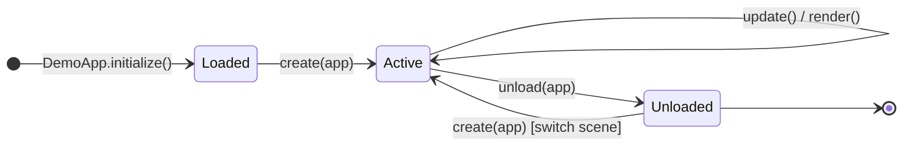
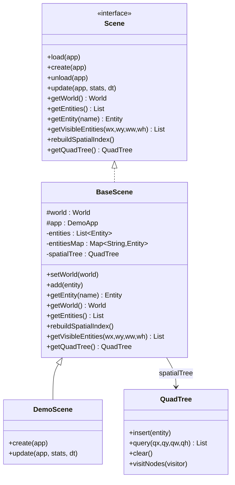
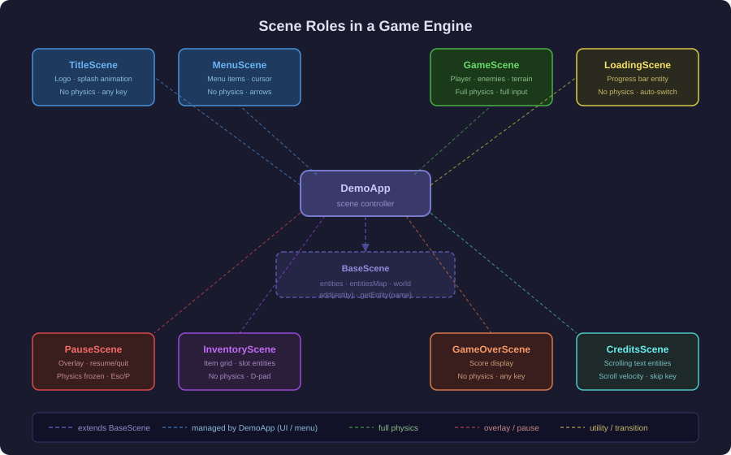
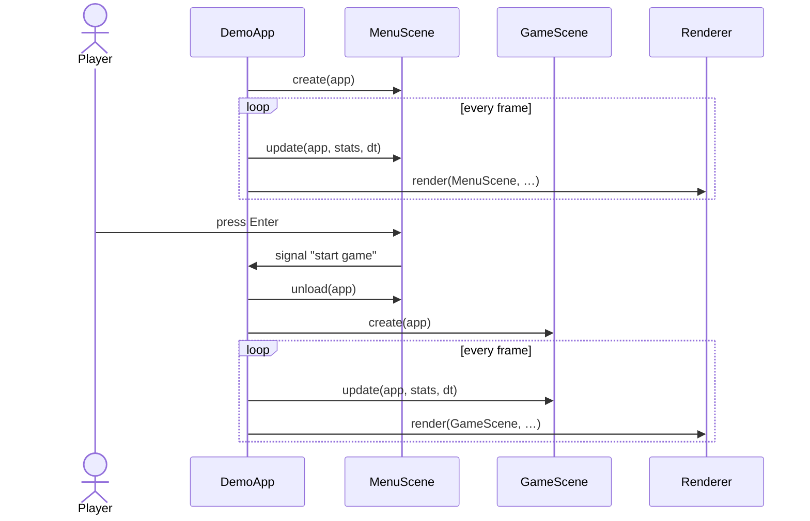
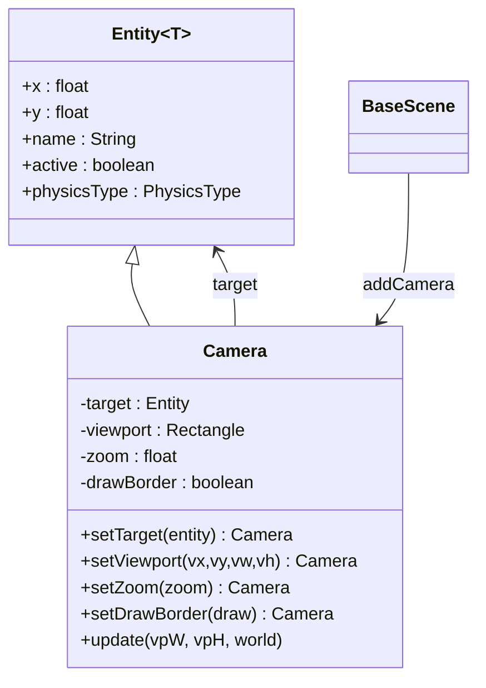
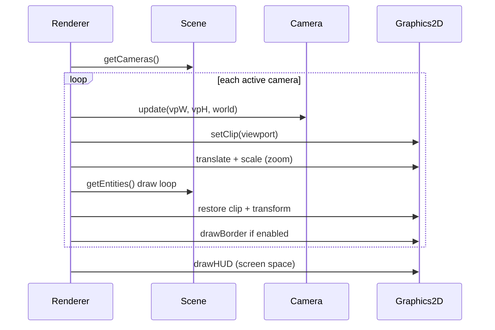

# 09 - Scene System

## Functional Role

The scene system is the organisational backbone of the game engine. It decouples **what is in the game world** (entities, physics, logic) from **how the engine drives it** (loop, renderer, input). Each `Scene` represents a self-contained, independently lifecycle-managed context: a title screen, a gameplay level, a pause overlay, an inventory view, a credits reel.

`DemoApp` holds a list of loaded scenes and one active `currentScene`. The active scene is:

1. **created** once — entities are built and inserted
2. **updated** every frame — logic, player input, physics
3. **rendered** every frame — via `Renderer.render(currentScene, …)`
4. **unloaded** when replaced by another scene — resources released



---

## Scene Interface

`Scene` (package `com.core.scene`) defines the full lifecycle contract:

```java
public interface Scene {
    default void load(DemoApp app) {}     // one-time resource loading
    void create(DemoApp app);             // build entities and world
    default void unload(DemoApp app) {}   // release resources
    void update(DemoApp app, Map<String, Object> stats, float deltaTime);

    World getWorld();
    List<Entity<?>> getEntities();
    Entity<?> getEntity(String name);

    // Spatial index — default no-op / pass-through for backward compatibility
    default List<Entity<?>> getVisibleEntities(float wx, float wy,
                                                float ww, float wh) { return getEntities(); }
    default void rebuildSpatialIndex() {}
    default QuadTree getQuadTree() { return null; }
}
```

| Method                    | Called by                   | Frequency                   | Typical use                                   |
|---------------------------|-----------------------------|-----------------------------|-----------------------------------------------|
| `load`                    | `DemoApp.initialize()`      | Once per scene registration | Load textures, audio, tile maps               |
| `create`                  | After scene is made active  | Once per activation         | Instantiate entities, configure world         |
| `update`                  | `DemoApp.loop()`            | Every frame                 | Input reaction, animation, physics delegation |
| `unload`                  | Before scene is deactivated | Once per deactivation       | Free graphical or audio resources             |
| `getWorld`                | `PhysicsEngine`             | Every frame                 | Supply the world bounds and gravity           |
| `getEntities`             | `PhysicsEngine`, `Renderer` | Every frame                 | Iterate over entities to update and draw      |
| `getEntity`               | `DemoApp`, custom logic     | On demand                   | Retrieve a named entity (e.g. `"player"`)     |
| `rebuildSpatialIndex`     | `DemoApp.update()`          | Every frame                 | Rebuild QuadTree after physics (default: nop) |
| `getVisibleEntities`      | `Renderer`                  | Every frame per camera      | Frustum-culled entity list for drawing        |
| `getQuadTree`             | `QuadTreeDebugBehavior`     | Every frame when debug > 3  | Expose the live spatial index for overlays    |

---

## BaseScene — Default Implementation

`BaseScene` (package `com.core.scene`) provides a ready-to-extend implementation:

- maintains a `CopyOnWriteArrayList<Entity<?>>` for thread-safe iteration during rendering
- maintains a `ConcurrentHashMap<String, Entity<?>>` for O(1) lookup by name
- exposes a `setWorld(World)` method that registers the World in the entity list, attaches `QuadTreeDebugBehavior`, and sets the `world` field — call this instead of direct field assignment
- holds a protected `world` field (also accessible via `getWorld()`)



---

## Configuration-Driven Scene Loading

Scenes are discovered at startup from `src/main/resources/scenes.properties`:

```properties
# Comma-separated list of fully-qualified scene class names
app.scenes=com.demo.scenes.DemoScene

# Scene to activate on startup
app.scene.default=com.demo.scenes.DemoScene
```

`DemoApp.createScene()` loads each class by name via reflection:

```java
Class<?> cls = Class.forName(className);
Scene scene = (Scene) cls.getDeclaredConstructor(DemoApp.class).newInstance(this);
add(scene);
```

Individual entries can be overridden from the command line without touching the file:

```bash
mvn exec:java -Dexec.args="app.scenes=com.demo.scenes.MenuScene app.scene.default=com.demo.scenes.MenuScene"
```

---

## Creating a Custom Scene

Extend `BaseScene`, override `create()` to populate entities using `setWorld()`, then override `update()` for per-frame logic:

```java
package com.demo.scenes;

import com.core.DemoApp;
import com.core.entity.GameObject;
import com.core.entity.World;
import com.core.physics.Material;
import com.core.physics.PhysicsType;
import com.core.scene.BaseScene;

public class MenuScene extends BaseScene {

    public MenuScene(DemoApp app) {
        super(app);
    }

    @Override
    public void create(DemoApp app) {
        // Use setWorld() — registers the World in the entity list and attaches
        // the QuadTreeDebugBehavior overlay automatically.
        setWorld(new World("menu-world")
                .setPosition(0, 0)
                .setSize(800, 600)
                .setGravity(0f, 0f));  // no gravity in a menu

        add(new GameObject("title_label")
                .setPosition(300f, 200f)
                .setSize(200, 40)
                .setPhysicsType(PhysicsType.NONE)
                .setMaterial(Material.DEFAULT));
    }

    @Override
    public void update(DemoApp app, java.util.Map<String, Object> stats, float deltaTime) {
        // react to key presses, animate elements, switch to GameScene, etc.
    }
}
```

Then register it in `scenes.properties`:

```properties
app.scenes=com.demo.scenes.MenuScene,com.demo.scenes.GameScene
app.scene.default=com.demo.scenes.MenuScene
```

---

## Scene Roles in a Typical Game

A game rarely consists of a single context. The scene system supports the full spectrum of runtime states, each implemented as a separate `Scene` subclass:

| Scene            | Typical content                 | Physics                    | Input                       |
|------------------|---------------------------------|----------------------------|-----------------------------|
| `TitleScene`     | Logo, animated splash           | None                       | Any key → next scene        |
| `MenuScene`      | Menu items, cursor entity       | None or minimal            | Arrow keys, Enter           |
| `GameScene`      | Player, enemies, terrain        | Full (gravity, collisions) | Full movement + action keys |
| `PauseScene`     | Overlay, resume/quit options    | Frozen                     | Escape or P to resume       |
| `InventoryScene` | Item grid, selected slot entity | None                       | D-pad navigation, confirm   |
| `GameOverScene`  | Score display, restart prompt   | None                       | Any key → restart           |
| `CreditsScene`   | Scrolling text entities         | Scroll velocity            | Skip key                    |
| `LoadingScene`   | Progress bar entity             | None                       | None (automatic transition) |

### Illustration — Scene Roles



---

## Scene Interaction Pattern

Scenes do not communicate directly. `DemoApp` acts as the scene controller: a scene signals a desired transition by setting a shared flag or by calling a method on `app`, and the main loop performs the swap cleanly between frames.



---

## Related Documentation

- [00-overview.md](./00-overview.md) — overall architecture and game loop
- [01-entity.md](./01-entity.md) — `Entity` base class
- [02-gameobject.md](./02-gameobject.md) — `GameObject` concrete subclass
- [03-physicsengine.md](./03-physicsengine.md) — physics pipeline fed by `Scene.getWorld()` and `Scene.getEntities()`

---

## Camera System

**Package:** `com.core.gfx`

`Camera` extends `Entity` and defines a rectangular viewport on the game window, optionally tracking a target entity in world space. A scene may hold any number of cameras; each active one triggers a separate rendering pass.

### Properties

| Property     | Type        | Default | Description                                    |
|--------------|-------------|---------|------------------------------------------------|
| `target`     | `Entity<?>` | `null`  | Entity to follow each frame (may be `null`)    |
| `viewport`   | `Rectangle` | `null`  | Position and size on the window in pixels      |
| `zoom`       | `float`     | `1.0`   | Scale factor (`<1` = zoom out, `>1` = zoom in) |
| `drawBorder` | `boolean`   | `false` | Draw a border rectangle around the viewport    |

When `viewport` is `null` **and** the scene has a single camera, the `Renderer` auto-sizes it to the full window.

### World-to-Screen Transform

The `Renderer` applies the following affine transform before drawing each frame through a camera:

$$screen_x = vp_x + (world_x - cam_x) \times zoom$$
$$screen_y = vp_y + (world_y - cam_y) \times zoom$$

where $(vp_x, vp_y)$ is the viewport origin on the window.

### Target Tracking and World Clamping

`Camera.update(viewportWidth, viewportHeight, world)` is called by the `Renderer` at the start of each camera pass. It centres the camera on the target's centre:

```
cam.x = target.x + target.width/2  - (viewportWidth  / zoom) / 2
cam.y = target.y + target.height/2 - (viewportHeight / zoom) / 2
```

The result is then clamped to the world bounds so the viewport never reveals area outside the simulation rectangle:

```
cam.x = clamp(cam.x, world.minX(), world.maxX() - viewportWidth/zoom)
cam.y = clamp(cam.y, world.minY(), world.maxY() - viewportHeight/zoom)
```

### Class Diagram



### Rendering Pipeline with Cameras



### Fallback — No Camera

When `scene.getCameras()` is empty (or all cameras are inactive), the `Renderer` draws entities directly in world space with no transform and no clip. This is useful for simple scenes or debugging.

### Registering Cameras in a Scene

Cameras are registered via `BaseScene.addCamera()`. They are stored in a `CopyOnWriteArrayList` separate from the entity list, so they are never processed by the physics engine.

```java
// Full-window camera that follows the player
addCamera(new Camera("main_camera")
        .setTarget(getEntity("player"))
        .setZoom(1.0f));

// Fixed minimap in the bottom-right corner showing the full world
int mw = 100, mh = 100;
float minimapZoom = Math.min((float) mw / world.getWidth(), (float) mh / world.getHeight());
addCamera(new Camera("minimap_camera")
        .setViewport(winW - mw - 10, winH - mh - 10, mw, mh)
        .setZoom(minimapZoom)
        .setDrawBorder(true));
```

### DemoScene Setup

| Camera           | Viewport                | Zoom   | Target       | Purpose                              |
|------------------|-------------------------|--------|--------------|--------------------------------------|
| `main_camera`    | auto (full window)      | 1.0    | `player`     | Follows the player, clamped to world |
| `minimap_camera` | bottom-right 100×100 px | ~0.083 | none (fixed) | Overview of the whole world          |

- [04-world.md](./04-world.md) — `World` component held by each scene
