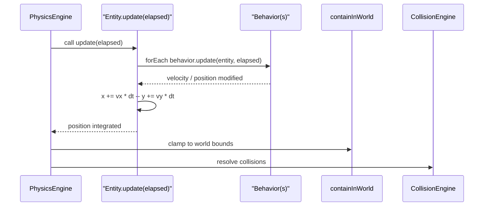
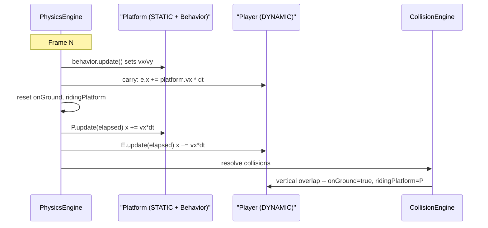
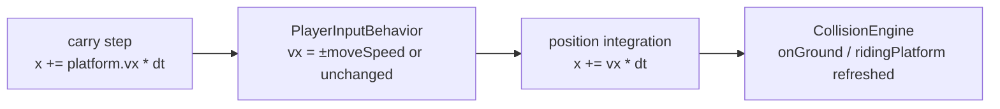
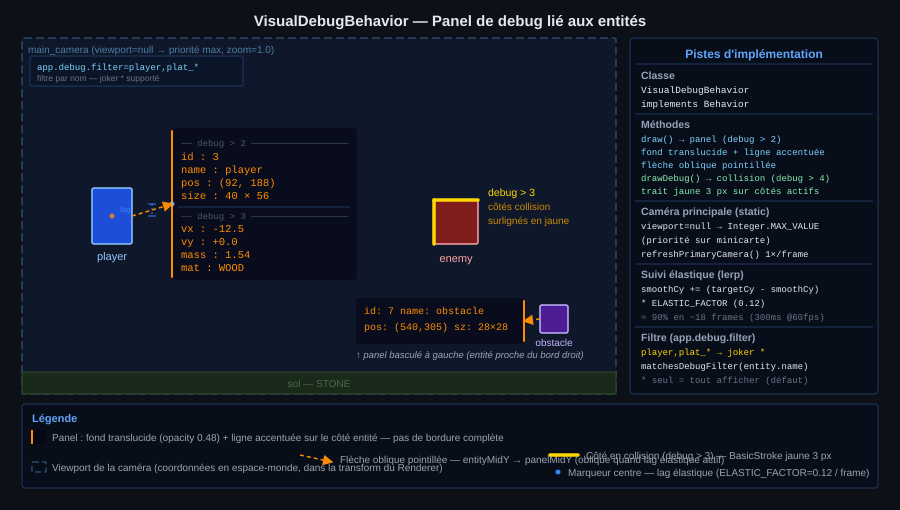
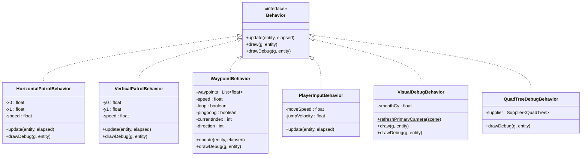
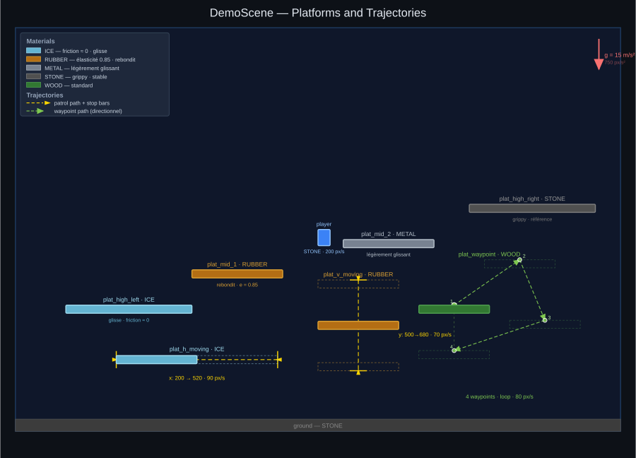

# 10 - Behavior System

**Package:** `com.core.behavior`

## Functional Role

The Behavior system provides a composable, frame-driven way to attach autonomous logic to any `Entity`. A behavior receives a reference to its host entity each frame and may freely modify its velocity, position, or any other public field before the physics engine integrates the result.

Behaviors are the primary mechanism for:

- **Moving platforms** — `HorizontalPatrolBehavior`, `VerticalPatrolBehavior`, `WaypointBehavior`
- **Player control** — `PlayerInputBehavior`
- Any future per-entity logic (AI, animations, triggers, …)

---

## `Behavior` Interface

```java
public interface Behavior {
    void update(Entity<?> entity, long elapsed);
    default void draw(Graphics2D g, Entity<?> entity) {}
    default void drawDebug(Graphics2D g, Entity<?> entity) {}
}
```

| Method      | Called when                                  | Purpose                                    |
|-------------|----------------------------------------------|--------------------------------------------|
| `update`    | Every frame, **before** position integration | Modify velocity / position                 |
| `draw`      | Every frame, after entities are drawn        | Persistent visual overlays (e.g. aim line) |
| `drawDebug` | Every frame when `DemoApp.debug > 3`         | Development overlays (trajectory, bounds)  |

`draw` and `drawDebug` have default no-op implementations — only override what is needed.

### Execution Order in the Frame



Behaviors run **before** position integration, so setting `vx` or `vy` inside `update()` is reflected in the same frame's movement.

### Adding a Behavior to an Entity

```java
entity.addBehavior(new HorizontalPatrolBehavior(100f, 500f, 80f));
```

Multiple behaviors can be chained; they execute in insertion order.

---

## Moving Platforms

### `HorizontalPatrolBehavior`

Oscillates an entity between two X bounds at constant speed. Intended for `STATIC` platforms.

**Constructor:**
```java
new HorizontalPatrolBehavior(float x0, float x1, float speed)
```

| Parameter | Description                            |
|-----------|----------------------------------------|
| `x0`      | Left bound in world pixels             |
| `x1`      | Right bound in world pixels            |
| `speed`   | Travel speed in px/s (sign is ignored) |

**Algorithm:** on each frame, if `entity.x ≤ x0` set `vx = +speed`; if `entity.x + width ≥ x1` set `vx = -speed`. The entity's position is then integrated normally by the physics engine.

**Debug overlay (`drawDebug`):** dotted yellow horizontal line between `x0` and `x1` at the entity's vertical centre, with solid vertical bars at each end-stop.

---

### `VerticalPatrolBehavior`

Oscillates an entity between two Y bounds at constant speed. Intended for `STATIC` platforms.

**Constructor:**
```java
new VerticalPatrolBehavior(float y0, float y1, float speed)
```

| Parameter | Description                            |
|-----------|----------------------------------------|
| `y0`      | Top bound in world pixels              |
| `y1`      | Bottom bound in world pixels           |
| `speed`   | Travel speed in px/s (sign is ignored) |

**Algorithm:** symmetric to `HorizontalPatrolBehavior` on the Y axis.

**Debug overlay:** dotted yellow vertical line between `y0` and `y1`, with solid horizontal bars at each end-stop.

---

### `WaypointBehavior`

Moves an entity through an ordered list of world-space waypoints at constant speed. Supports three end-of-path policies.

**Constructor:**
```java
new WaypointBehavior(List<float[]> waypoints, float speed, boolean loop, boolean pingpong)
```

| Parameter   | Description                                                       |
|-------------|-------------------------------------------------------------------|
| `waypoints` | Ordered list of `[x, y]` world-pixel coordinates (centre of path) |
| `speed`     | Travel speed in px/s (sign is ignored)                            |
| `loop`      | Jump back to waypoint 0 after the last                            |
| `pingpong`  | Reverse direction at each end (takes priority over `loop`)        |

**Algorithm:** each frame, compute the vector from the entity's centre to the current target waypoint; normalise it and scale by `speed` to obtain `(vx, vy)`. When the distance falls below the 2 px threshold, `advance()` selects the next target according to the active policy.

| `loop` | `pingpong` | End-of-path behaviour   |
|--------|------------|-------------------------|
| false  | false      | Stop at last waypoint   |
| true   | false      | Jump back to waypoint 0 |
| —      | true       | Reverse direction       |

**Debug overlay:** dotted yellow segments connecting consecutive waypoints; a dashed return segment from last to first when `loop = true`; circles on each waypoint node (larger and brighter for the current target).

---

## Platform Carrying

When a `DYNAMIC` entity stands on a `STATIC` entity that itself moves (because its behavior modifies `vx`/`vy`), the player would otherwise slide off or be left behind. The engine handles this transparently through two fields on `Entity`:

| Field            | Type        | Meaning                                                                                      |
|------------------|-------------|----------------------------------------------------------------------------------------------|
| `onGround`       | `boolean`   | Set by `CollisionEngine` when a downward vertical collision with a STATIC entity is resolved |
| `ridingPlatform` | `Entity<?>` | Set to the STATIC entity the DYNAMIC entity is resting on                                    |

Both flags are **reset at the start of each physics frame** and **re-evaluated by CollisionEngine** after each collision pass.

### Carry Step in PhysicsEngine

Before resetting the flags, `PhysicsEngine` applies the platform's displacement to the riding entity:

```
// Step 1: carry riders (using last frame's ridingPlatform)
e.x += ridingPlatform.vx * dt
if (ridingPlatform.vy < 0) e.y += ridingPlatform.vy * dt  // upward carry only
```

Downward carry is intentionally omitted: gravity and collision resolution handle the descent naturally, which avoids over-pushing the entity into the platform's top face.



---

## Player Input — `PlayerInputBehavior`

Translates keyboard state into velocity on the owning entity each frame. Designed for a 2D platformer where precise stop-and-go control matters.

**Constructor:**
```java
new PlayerInputBehavior(float moveSpeed, float jumpVelocity)
```

| Parameter      | Description                                                     |
|----------------|-----------------------------------------------------------------|
| `moveSpeed`    | Horizontal speed in px/s (sign is ignored, direction from keys) |
| `jumpVelocity` | Vertical velocity applied on jump (negative = upward)           |

### Key Mapping

| Key            | Action                                          |
|----------------|-------------------------------------------------|
| `LEFT` / `A`   | `entity.vx = -moveSpeed`                        |
| `RIGHT` / `D`  | `entity.vx = +moveSpeed`                        |
| `SPACE` / `UP` | `entity.vy = jumpVelocity` if `entity.onGround` |

**Jump guard:** the jump is only applied when `entity.onGround == true` (set by `CollisionEngine`). After the jump, `onGround` is set to `false` immediately to prevent double-jumping within the same press.

**Horizontal idle:** when no lateral key is held, `vx` is left unchanged. Material friction (applied by `PhysicsEngine` each frame as a damping factor) brings the entity to rest naturally. This avoids abrupt stops while keeping the code simple.

### Interaction with Platform Carrying

When the player stands on a moving platform, the carry step in `PhysicsEngine` adds the platform's `vx` to the player's position **before** `PlayerInputBehavior` runs. The player's own `vx` from key input then adds on top, giving intuitive control: running in the platform's direction feels faster; running against it feels slower.



---

## Visual Debug — `VisualDebugBehavior`

Renders a floating debug panel beside each instrumented entity. The panel is linked to its entity by an oblique dashed arrow and tracks the entity's vertical position with a soft elastic lag.



### Activation Levels

| Level | What is rendered | Method |
|-------|------------------|--------|
| `debug > 2` | Panel section 1 — `id`, `name`, `pos`, `size` | `draw()` |
| `debug > 3` | Panel section 2 — `vx`, `vy`, `mass`, `mat` (added below a separator) | `draw()` |
| `debug > 3` | Yellow strokes on active collision sides | `drawDebug()` |
| any  | Cyan velocity vector from entity centre (when speed ≥ 1 px/s) | `draw()` |

### Entity Name Filter

Panels are only shown for entities whose name matches `app.debug.filter` in `config.properties`:

```properties
# Comma-separated patterns; * is a wildcard. Default: all entities.
app.debug.filter=player,plat_*
```

The filter is loaded by `DemoApp.parseConfiguration()` into `DemoApp.debugFilter`. The helper `DemoApp.matchesDebugFilter(name)` handles matching: each pattern is split on `*`, each part is `Pattern.quote`d, and parts are joined with `.*`. A lone `*` matches any name.

### Static Camera Selection

All `VisualDebugBehavior` instances draw in world space (inside the Renderer's camera transform). They share a single `static Camera primaryCamera`, updated once per frame:

```java
VisualDebugBehavior.refreshPrimaryCamera(scene);   // called by Renderer
```

The camera with the **largest viewport area** is selected. Cameras with `viewport == null` (full-window) are assigned an area of `Integer.MAX_VALUE` so they always win over minimap cameras.

### Panel Positioning

All sizing constants are defined in **screen pixels** and divided by `zoom` at render time:

| Constant | Value | Purpose |
|---|---|---|
| `PANEL_SCREEN_W` | 148 px | Panel width |
| `MARGIN_SCREEN` | 20 px | Horizontal gap between entity edge and panel edge |
| `PADDING_SCREEN` | 3 px | Inner padding |
| `FONT_SIZE_SCREEN` | 9 px | Monospaced font size |
| `LINE_HEIGHT_MULT` | 1.3 | `lineHeight = fontSize × 1.3` |
| `ARC_SCREEN` | 3 px | Corner radius |

**Entity visibility check** — before any layout calculation, `drawPanel` tests whether the entity's bounding box intersects the visible world rectangle. If the entity is entirely outside the viewport, a compact [mini-panel](#mini-panel-entity-outside-viewport) is rendered instead (see below).

**Horizontal side** — three-step preference, evaluated in order:

1. **Right fits** — `entity.right + margin + panelWidth ≤ worldRight` → place right.
2. **Left fits** — `entity.x − margin − panelWidth ≥ worldLeft` → place left.
3. **Neither fits** — place on the side with more available space (`spaceRight` vs `spaceLeft`).

```
fitsRight = entity.right + margin + pw ≤ worldRight
fitsLeft  = entity.x − margin − pw   ≥ worldLeft
onRight   = fitsRight ? true
          : fitsLeft  ? false
          : (worldRight − entity.right) ≥ (entity.x − worldLeft)
panelX    = onRight ? entity.right + margin : entity.x − pw − margin
```

**Vertical position** — derived from `smoothCy` (see below), then clamped inside the visible viewport bounds.

### Elastic Vertical Tracking

Each instance holds a per-entity `smoothCy` (initialised to `Float.NaN`). On every draw call:

```
smoothCy += (targetCy − smoothCy) × ELASTIC_FACTOR   // ELASTIC_FACTOR = 0.12
```

`targetCy = entity.y + entity.height / 2`. The panel converges to the entity centre in roughly 18 frames (≈ 300 ms at 60 fps), creating a trailing effect when the entity moves quickly.

### Panel Visual Design

- **Background** — `AlphaComposite.SRC_OVER, 0.48f`, dark (`Color(2, 2, 14)`), rounded corners.
- **Accent line** — a 2 px orange vertical stroke on the entity-facing side only (left edge when the panel is to the right, right edge when to the left). There is no full border.
- **Oblique dashed arrow** — from the entity's edge at `entityMidY` to the panel edge at `panelMidY`. The arrow is oblique when the elastic offset makes `panelMidY ≠ entityMidY`. A small filled triangle serves as the arrowhead.
- **Separator line** (`#1E3A5F`) between the two debug sections.
- **Font/AA save-restore** — the current `Font` and `RenderingHints.KEY_TEXT_ANTIALIASING` are saved before text rendering and restored afterward so other entities' graphics state is not affected.

### Mini-Panel: Entity Outside Viewport

When an entity is **entirely outside** the camera's visible world rectangle, `drawPanel` delegates to `drawMiniPanel`, which renders a compact 2-line panel (`id` + `name`) anchored to the nearest viewport edge:

| Primary off-screen direction | Panel anchored to | Free-tracking axis |
|---|---|---|
| Right | Right edge | Y follows entity (clamped) |
| Left | Left edge | Y follows entity (clamped) |
| Bottom | Bottom edge | X follows entity (clamped) |
| Top | Top edge | X follows entity (clamped) |

The *primary direction* is the one with the greatest overflow distance among the four edges. The accent line is placed on the panel side that points toward the entity (vertical for left/right, horizontal for top/bottom). Text is rendered at `COLOR_TEXT.darker()` to visually distinguish off-screen entities. No dashed arrow is drawn.

```
miniW  = PANEL_SCREEN_W × 0.72 / zoom
miniH  = padding × 2 + 2 × lineH
```

### Collision Side Highlights (debug > 3)

`drawDebug()` paints a 3 px `Color.YELLOW` `BasicStroke` on each side whose flag is `true`. The four fields on `Entity` — `collisionTop`, `collisionBottom`, `collisionLeft`, `collisionRight` — are reset every frame by `PhysicsEngine` and set by `CollisionEngine`.

### Velocity Vector Overlay

`draw()` draws a **cyan arrow** from the entity's centre, indicating the direction and magnitude of the current velocity. The arrow is always visible when the entity's debug behavior is active (no extra debug level required), and is suppressed when the speed falls below 1 px/s.

**Visual encoding:**

| Property | Value |
|---|---|
| Color | Cyan (`#00E5FF`) |
| Origin | Entity centre `(cx, cy)` |
| Direction | Normalised `(vx, vy)` |
| Length (screen px) | `min(speed × 0.08, 80)`, then divided by zoom |
| Arrowhead | Filled triangle; wing spread proportional to arrow length |
| Speed label | Displayed beside the arrowhead only when `debug > level + 1` |

The length is computed in screen pixels and converted to world units by dividing by the camera zoom, so the arrow appears at a consistent screen size regardless of zoom level.

**Constants (defined in `VisualDebugBehavior`):**

| Constant | Value | Meaning |
|---|---|---|
| `VELOCITY_PX_PER_UNIT` | `0.08f` | Screen px per px/s speed unit |
| `VELOCITY_MAX_PX` | `80f` | Maximum arrow length in screen px |
| `VELOCITY_MIN_SPEED` | `1f` | Suppress arrow below this speed (px/s) |
| `COLOR_VELOCITY` | `#00E5FF` | Cyan fill/stroke |

```java
// Attach a velocity-visible debug behavior — no extra configuration needed
entity.addBehavior(new VisualDebugBehavior());
```

### Camera Viewport Initialisation

`drawPanel` computes `worldRight = cam.x + viewportWidth / zoom`. For this to be accurate, every camera must have its viewport rectangle set before the behavior draw pass. The `Renderer` now assigns the full window bounds to **any** active camera whose viewport is `null` (not only when there is a single camera), so a scene that uses both a main camera and a minimap camera will give each one a valid viewport.

### Attaching and Configuring

```java
// DemoScene.create() — attach to every entity
getEntities().forEach(e -> e.addBehavior(new VisualDebugBehavior()));
```

```properties
# config.properties
app.debug=3            # panel only (levels 2–3)
app.debug=5            # panel + collision-side highlights
app.debug.filter=*     # all entities (default)
app.debug.filter=player,plat_*   # only matching names
```

---

## QuadTree Debug Overlay — `QuadTreeDebugBehavior`

**Package:** `com.core.spatial`

Renders the live `QuadTree` spatial-index grid directly in world space as a debug overlay. Active only when `DemoApp.debug > 3` (via `drawDebug()`). Attached automatically to the `World` entity by `BaseScene.setWorld()`.

### Visual Encoding

| Element | Description |
|---|---|
| Cell borders | Colour-coded by depth: slate (depth 0–1) → amber (2) → cyan (3) → violet (4+) |
| Leaf fill | Semi-transparent emerald fill; opacity grows with entity count (max 95/255) |
| Count label | Entity count printed in the top-left corner of non-empty leaf cells |

Stroke width and font size are divided by the camera zoom so they remain visually stable on screen regardless of zoom level.

### How It Works

`QuadTreeDebugBehavior` is a `Behavior` with no `update()` or `draw()` logic. Its `drawDebug()` method:

1. Retrieves the `QuadTree` via the `Supplier<QuadTree>` passed at construction (bound to `BaseScene::getQuadTree`).
2. Reads the current zoom from the `Graphics2D` transform: `(float) g.getTransform().getScaleX()`.
3. Delegates drawing to `QuadTreeDebugOverlay.draw(g, tree, zoom)`.

```java
// Attached automatically by BaseScene.setWorld():
world.addBehavior(new QuadTreeDebugBehavior(this::getQuadTree));
```

### Why on `World`, Not in `Renderer`

By attaching the overlay as a `Behavior` on the `World` entity (which has `renderPriority = −100`), the grid is drawn **before** all game objects in the unified per-priority render loop — no special case in `Renderer`. The Renderer no longer imports `QuadTree` or `QuadTreeDebugOverlay`.

---

## Class Diagram



---

## DemoScene Platform Summary



| Entity          | Behavior                                 | Material | Notable Effect               |
|-----------------|------------------------------------------|----------|------------------------------|
| `plat_h_moving` | `HorizontalPatrolBehavior(200, 520, 90)` | ICE      | Glisse — difficile à tenir   |
| `plat_v_moving` | `VerticalPatrolBehavior(500, 680, 70)`   | RUBBER   | Ascenseur rebondissant       |
| `plat_waypoint` | `WaypointBehavior(4 points, 80, loop)`   | WOOD     | Trajectoire libre, en boucle |
| `player`        | `PlayerInputBehavior(200, -480)`         | STONE    | Lourd, grippy, saut réactif  |
