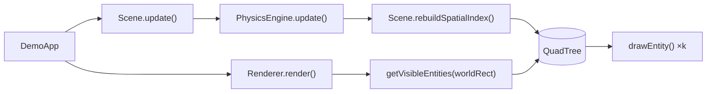
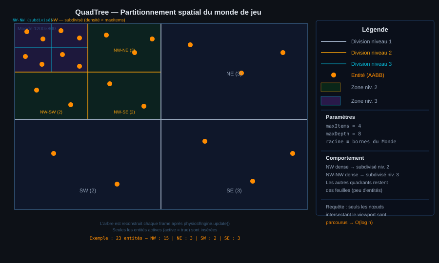
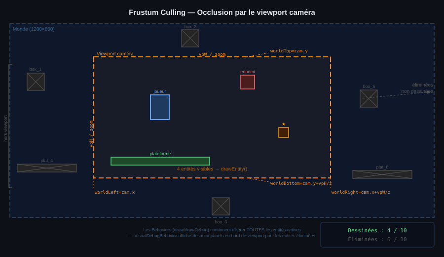

# 11 - Index Spatial et Frustum Culling

## Objectif fonctionnel

À mesure que le nombre d'entités augmente, la boucle de rendu devient un goulot d'étranglement : sans optimisation, `Renderer.render()` appelle `drawEntity()` pour **toutes** les entités actives, même celles entièrement hors du viewport de la caméra.

Ce chapitre décrit les deux mécanismes complémentaires qui réduisent ce coût :

| Technique | Rôle | Complexité cible |
|---|---|---|
| **QuadTree** | Partitionne l'espace 2D pour retrouver rapidement les entités dans une zone | O(log n + k) |
| **Frustum culling** | Élimine les entités hors du viewport avant `drawEntity()` | — |

> [!NOTE]
> La simulation physique (`PhysicsEngine`, `CollisionEngine`) continue d'itérer **toutes** les entités — seul le rendu est filtré.

---

## Architecture



### Composants concernés

| Composant | Package | Modification |
|---|---|---|
| `QuadTree` | `com.core.spatial` | **Nouveau** — structure AABB 2D + `visitNodes()` pour le debug overlay |
| `QuadTreeDebugBehavior` | `com.core.spatial` | **Nouveau** — behavior attaché au `World`; dessine la grille quand `debug > 3` |
| `QuadTreeDebugOverlay` | `com.core.spatial` | **Nouveau** — logique de rendu de la grille (délégué par le behavior) |
| `Scene` | `com.core.scene` | +`getVisibleEntities()` +`rebuildSpatialIndex()` +`getQuadTree()` (default) |
| `BaseScene` | `com.core.scene` | Implémentation concrète avec `spatialTree`; `setWorld()` attache le behavior |
| `DemoApp` | `com.core` | Appel `rebuildSpatialIndex()` après la physique |
| `Renderer` | `com.core.gfx` | Boucle de rendu unifiée triée par `renderPriority`; compteur `obj:N/M` dans le HUD |

---

## QuadTree (`com.core.spatial`)

### Principe

L'arbre divise récursivement le monde en quatre quadrants (NW, NE, SW, SE). Quand un nœud feuille dépasse la capacité maximale (`maxItems`) et que la profondeur autorisée n'est pas atteinte (`maxDepth`), il se **subdivise** et redistribue ses entités dans les enfants.



### Paramètres recommandés

| Paramètre | Valeur | Raison |
|---|---|---|
| `maxItems` | `4` | Seuil bas = arbre plus fin, requêtes plus rapides |
| `maxDepth` | `8` | Évite une explosion mémoire sur grands mondes denses |

### Invariants

- Les bornes du nœud racine **coïncident** avec `world.x, world.y, world.width, world.height`.
- Une entité dont l'AABB chevauche plusieurs quadrants est insérée dans **tous** les nœuds concernés. La déduplication est faite à la requête via un `LinkedHashSet`.
- L'arbre est **entièrement reconstruit** chaque frame (après la physique). Pas de mise à jour incrémentale — sur < 500 entités le coût de reconstruction est négligeable devant Java2D.

### API publique

```java
// Construction (racine)
QuadTree(float x, float y, float w, float h, int maxItems, int maxDepth)

// Insérer une entité (AABB = e.x, e.y, e.width, e.height)
void insert(Entity<?> e)

// Requête rectangulaire — liste dédupliquée
List<Entity<?>> query(float qx, float qy, float qw, float qh)

// Effacer l'arbre (appelé au début de rebuildSpatialIndex)
void clear()
// Visite chaque noeud en profondeur (utilisé par QuadTreeDebugBehavior)
void visitNodes(Consumer<NodeInfo> visitor)```

---

## Intégration dans Scene / BaseScene

### Interface `Scene` — nouvelles méthodes `default`

```java
/** Renvoie les entités dont l'AABB chevauche (wx, wy, ww, wh).
 *  Default : toutes les entités — aucun filtrage. */
default List<Entity<?>> getVisibleEntities(float wx, float wy,
                                            float ww, float wh) {
    return getEntities();
}

/** Reconstruit l'index spatial. Appelé une fois par frame avant le rendu.
 *  Default : no-op. */
default void rebuildSpatialIndex() { }
```

Les méthodes étant des `default`, toute scène existante **continue de fonctionner** sans modification ; la sélection spatiale n'est active que dans les sous-classes qui héritent de `BaseScene`.

### `BaseScene` — implémentation

```java
private QuadTree spatialTree = null;

@Override
public void rebuildSpatialIndex() {
    World w = getWorld();
    if (w == null) return;
    if (spatialTree == null) {
        spatialTree = new QuadTree(w.x, w.y, w.width, w.height, 4, 8);
    } else {
        spatialTree.clear();
    }
    for (Entity<?> e : entities) {
        // Entities with physicsType NONE (including World itself) are excluded:
        // their AABB covers the entire world and would pollute every spatial query.
        if (e.active && e.physicsType != PhysicsType.NONE) spatialTree.insert(e);
    }
}

@Override
public List<Entity<?>> getVisibleEntities(float wx, float wy,
                                           float ww, float wh) {
    if (spatialTree == null) return entities;
    return spatialTree.query(wx, wy, ww, wh);
}

@Override
public QuadTree getQuadTree() {
    return spatialTree;
}
```

---

## Boucle de rendu unifiée dans `Renderer`

### Calcul du rectangle monde visible

Pour chaque caméra active, le rectangle monde visible est :

```
worldLeft   = cam.x
worldTop    = cam.y
worldRight  = cam.x + viewport.width  / zoom
worldBottom = cam.y + viewport.height / zoom
```



### Pipeline de rendu (par caméra)

Après l’application du transform caméra (`g.translate` + `g.scale`), le `Renderer` exécute **une seule boucle unifiée** triée par `renderPriority` :

```java
List<Entity<?>> allSorted = scene.getEntities().stream()
        .filter(Entity::isActive)
        .sorted((a, b) -> a.renderPriority - b.renderPriority)
        .toList();

for (Entity<?> e : allSorted) {
    if (visibleSet.contains(e.id)) {   // frustum culling
        visibleIds.add(e.id);           // compteur HUD
        drawEntity(g, e);               // forme de l'entité
    }
    for (var b : e.behaviors) {
        b.draw(g, e);                   // toujours
        if (DemoApp.debug > 3) {
            b.drawDebug(g, e);          // overlays debug
        }
    }
}
```

Le `World` (priorité `−100`) est donc toujours le premier itéré : son `drawDebug()` via `QuadTreeDebugBehavior` dessine la grille QuadTree **en fond**, avant toutes les entités de jeu.

`visibleSet` est construit par une requête frustrée préalable :

```java
List<Entity<?>> visible = scene.getVisibleEntities(cam.x, cam.y, worldW, worldH);
Set<Long> visibleSet = new LinkedHashSet<>();
visible.forEach(e -> { if (e.isActive()) visibleSet.add(e.id); });
```

### Behaviors — non filtrés par le frustum

Les behaviors (`draw` / `drawDebug`) sont appelés pour toutes les entités actives, même celles hors-écran. Cela permet à `VisualDebugBehavior` d’afficher son mini-panel ancré au bord du viewport même quand l’entité n’est pas visible, et à `QuadTreeDebugBehavior` de s’exécuter sur le `World` dont la forme (`drawEntity`) est toujours exclue par le frustum (sa surface égale exactement les bornes du monde).

---

## Compteur de visibilité dans le HUD

Lorsque `DemoApp.debug > 0`, la barre de debug affiche :

```
[ dbg:3 | obj:12/40 | elapsed:16 | time:00:01:30 | FPS:060 | pause:OFF ]
```

`obj:N/M` = entités dessinées / total des entités actives (dédupliqué sur toutes les caméras).

Le comptage est géré par `Renderer.render()` via un `Set<Long>` d'identifiants d'entités :
```java
Set<Long> visibleIds = new LinkedHashSet<>();   // dédupliqué par camera
// ...
stats.put("visibleEntities", visibleIds.size());
stats.put("totalEntities", totalActive);
```

---

## Performances attendues

| Scénario | Sans index | Avec QuadTree |
|---|---|---|
| 20 entités, 15 visibles | 20 `drawEntity()` | ~15 |
| 200 entités, 40 visibles | 200 `drawEntity()` | ~40 |
| 2 000 entités, 80 visibles | 2 000 `drawEntity()` | ~80 |
| Reconstruction / frame | — | O(n log n) |
| Requête viewport | — | O(log n + k), k = résultats |
| **Gain rendu** | 1× | **~4–5×** sur niveaux denses |

---

## Tests unitaires

`QuadTreeTest` (package `com.demo`) couvre les scénarios suivants :

| Groupe | Cas testés |
|---|---|
| **Insertion** | Entité dans les bornes présente en requête globale ; entité hors-bornes ignorée ; plusieurs entités toutes retrouvées |
| **Requête** | Requête NW ne retourne que les entités NW ; zone vide → liste vide ; entité partiellement chevauchante incluse |
| **Subdivision** | Dépassement de `maxItems` → subdivision transparente ; `maxDepth=0` → aucune subdivision |
| **Déduplication** | Entité à cheval sur deux quadrants → exactement 1 occurrence ; `clear()` vide l'arbre |

Lancer les tests :

```bash
mvn -B -ntp test
```
