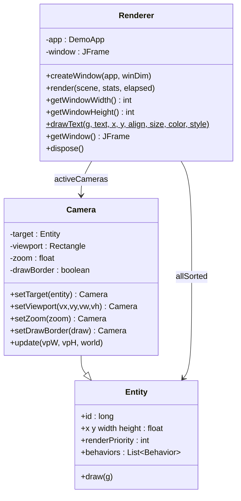

# 12 — Renderer & Camera

## Rôle

Le `Renderer` (package `com.core.gfx`) est le seul composant responsable du **dessin à l'écran**. Il est créé et détenu par `DemoApp`, qui l'appelle une fois par frame dans la boucle principale. À chaque appel `render()`, il :

1. crée ou réutilise la fenêtre Swing (`JFrame`),
2. obtient le `Graphics2D` depuis le `BufferStrategy` triple-buffer,
3. itère sur chaque caméra active et produit un rendu clip dans son viewport,
4. dessine le HUD en espace écran,
5. appelle `BufferStrategy.show()` pour basculer le buffer.

La `Camera` (même package) est une `Entity` spécialisée qui décrit une fenêtre d'observation du monde. Elle porte un rectangle viewport, un facteur de zoom et, optionnellement, une entité cible à suivre.

---

## Architecture



---

## Pipeline `render()` — vue d'ensemble

```
render(scene, stats, elapsed)
  │
  ├─ RenderingHints (antialiasing ON)
  ├─ clearRect (fond noir, pleine fenêtre)
  │
  ├─ [aucune caméra active] ──── fallback no-camera (voir §4)
  │
  └─ [pour chaque Camera active]
       ├─ cam.update() ─── suivi cible + clamping monde
       ├─ g.setClip(viewport)
       ├─ g.translate / g.scale  ──── transform monde→écran
       │
       ├─ frustum culling  ──── scene.getVisibleEntities()
       │
       └─ boucle unifiée triée par renderPriority
            ├─ si entité dans frustum → drawEntity(g, e)
            └─ pour chaque behavior de e
                 ├─ b.draw(g, e)             ← toujours
                 └─ b.drawDebug(g, e)        ← si debug > 3
       │
       ├─ g.setTransform / g.setClip  ──── restauration
       └─ drawBorder (optionnel)
  │
  ├─ drawHUD(g, stats)
  └─ bf.show()
```

---

## Transform monde → écran

Pour une caméra de position `(cam.x, cam.y)` avec un zoom `z`, le pixel écran correspondant au point monde `(wx, wy)` est :

$$
\text{screen.x} = \text{vp.x} + (wx - \text{cam.x}) \times z
$$
$$
\text{screen.y} = \text{vp.y} + (wy - \text{cam.y}) \times z
$$

Le `Renderer` applique ce transform en deux appels Java2D :

```java
g.translate(vp.x - cam.x * zoom, vp.y - cam.y * zoom);
g.scale(zoom, zoom);
```

Après ce transform, **tous les dessins sont en coordonnées monde**. Les behaviors et overlays debug opèrent donc directement en coordonnées monde ; c'est le `Graphics2D` lui-même qui se charge de la projection vers l'écran.

---

## Frustum Culling

Le rectangle monde visible d'une caméra est :

| Coordonnée | Formule |
|---|---|
| left   | `cam.x` |
| top    | `cam.y` |
| right  | `cam.x + vp.width / zoom` |
| bottom | `cam.y + vp.height / zoom` |

Le `Renderer` interroge `scene.getVisibleEntities(cam.x, cam.y, worldW, worldH)`, qui délègue au `QuadTree` de `BaseScene`. Le résultat est un `Set<Long>` d'identifiants d'entités visibles.

Seule la **forme** de l'entité (`drawEntity`) est sautée si elle n'est pas dans le frustum. Les **behaviors** sont toujours exécutés (draw + drawDebug) pour permettre à `VisualDebugBehavior` d'afficher un mini-panel ancré au bord du viewport pour les entités hors-écran.

---

## Boucle de rendu unifiée

```java
List<Entity<?>> allSorted = scene.getEntities().stream()
        .filter(Entity::isActive)
        .sorted((a, b) -> a.renderPriority - b.renderPriority)
        .toList();

for (Entity<?> e : allSorted) {
    if (visibleSet.contains(e.id)) {
        visibleIds.add(e.id);   // compteur HUD
        drawEntity(g, e);
    }
    for (var b : e.behaviors) {
        b.draw(g, e);
        if (DemoApp.debug >= b.getDebugLevel()) b.drawDebug(g, e);
    }
}
```

### Ordre de rendu par priorité

| `renderPriority` | Entité / usage |
|---|---|
| `−100` | `World` — fond, grille QuadTree (via `QuadTreeDebugBehavior`) |
| `0` (défaut) | Entités de jeu (plateformes, objets, ennemis) |
| `+50` (exemple) | Effets de premier plan, particules |
| `+100` (exemple) | UI in-world, bulles de dialogue |

Les caméras et entités `physicsType = NONE` non-world peuvent elles aussi se voir attribuer une priorité selon les besoins.

---

## Fallback sans caméra

Quand aucune caméra n'est active, le `Renderer` effectue un rendu direct sans transform (coordonnées monde = coordonnées écran), trié par `renderPriority`. Tous les comportements sont exécutés. Ce mode n'applique ni clip ni frustum culling.

---

## HUD (`drawHUD`)

Dessiné en **espace écran** après restauration du transform (pas de `g.translate/scale`). Contenu :

| Élément | Condition | Description |
|---|---|---|
| Titre d'accueil | toujours | i18n `app.message.welcome`, coin haut-gauche |
| Hint ESC | toujours | i18n `app.message.exit`, coin bas-droit |
| Barre de debug | `debug > 0` | fond noir semi-transparent, texte orange |

**Format de la barre de debug :**
```
[ dbg:<level> | obj:<visible>/<total> | elapsed:<ms> | time:<hh:mm:ss> | FPS:<fps> | pause:<ON|OFF> ]
```

---

## Caméra (`Camera`)

### Construction et configuration

```java
Camera cam = new Camera("main")
        .setTarget(player)              // suit l'entité player
        .setViewport(0, 0, 1200, 800)   // plein écran
        .setZoom(1.5f)                  // zoom in ×1.5
        .setDrawBorder(false);
```

Si `setViewport()` n'est pas appelé, le `Renderer` auto-dimensionne le viewport à la taille complète de la fenêtre.

### Suivi de cible et clamping

`Camera.update()` est appelé par le `Renderer` avant chaque passe de rendu. Il :

1. Centre la caméra sur le **centre** de l'entité cible :
   ```
   cx = target.x + target.width/2  − (viewportWidth  / zoom) / 2
   cy = target.y + target.height/2 − (viewportHeight / zoom) / 2
   ```
2. Clamp dans les bornes monde (si `world != null`) :
   ```
   cx ∈ [world.minX(), world.maxX() − viewportWidth/zoom]
   cy ∈ [world.minY(), world.maxY() − viewportHeight/zoom]
   ```

### Plusieurs caméras — rendu split-screen

Chaque caméra déclenche une passe indépendante ; les caméras avec un viewport réduit réalisent naturellement un split-screen ou une minimap :

```java
// Caméra principale — moitié gauche
Camera main = new Camera("main")
        .setTarget(player)
        .setViewport(0, 0, 600, 800)
        .setZoom(1f);

// Minimap — coin bas-droit, zoom out
Camera mini = new Camera("minimap")
        .setViewport(850, 550, 320, 220)
        .setZoom(0.25f)
        .setDrawBorder(true);
```

---

## Enregistrement dans `DemoApp`

```java
// DemoScene.create() — enregistrer les caméras
addCamera(new Camera("main")
        .setTarget(player)
        .setZoom(1.5f));
```

`DemoApp.render()` appelle `renderer.render(scene, stats, elapsed)` une fois par frame après la mise à jour physique et le rebuild du spatial index.

---

## API publique

| `registerPlugin(plugin)` | Enregistre un plugin avec priorité maximale (vérifié en premier) |
| `createWindow(app, dim)` | Crée la `JFrame`, appelle `pack()` + `setVisible()`, initialise le `BufferStrategy(3)` |
| `render(scene, stats, elapsed)` | Boucle de rendu complète (appelée par `DemoApp`) |
| `getWindowWidth()` | Largeur courante de la fenêtre en pixels |
| `getWindowHeight()` | Hauteur courante de la fenêtre en pixels |
| `drawText(g, text, x, y, align, size, color, style)` | Utilitaire statique — dessine un texte avec police, alignement et couleur |
| `getWindow()` | Renvoie la `JFrame` (pour event listeners, titres dynamiques…) |
| `dispose()` | Libère la fenêtre Swing |

---

## Plugin Architecture

`drawEntity()` délègue à une chaîne de plugins `EntityRenderer<T>` (package `com.core.gfx.plugin`). Le `Renderer` parcourt la liste et appelle le premier plugin dont `supports()` retourne `true`.

### Plugins fournis

| Plugin | Condition `supports()` | Forme dessinée |
|---|---|---|
| `PointRenderer` | `GameObject` avec `nature == POINT` | Cercle rempli, rayon `max(2, width/2)` |
| `LineRenderer` | `GameObject` avec `nature == LINE` | Segment `(x,y)→(x2,y2)` |
| `RectangleRenderer` | `GameObject` avec `nature == RECTANGLE` | Rectangle rempli + contour |
| `EllipseRenderer` | `GameObject` avec `nature == ELLIPSE` | Ellipse remplie + contour |
| `ImageRenderer` | `GameObject` avec `nature == IMAGE && image != null` | Image scalée sur la bounding box |
| `DefaultEntityRenderer` | catch-all | Délègue à `entity.draw(g)` (rétrocompatibilité) |

Les plugins par défaut sont enregistrés à la construction du `Renderer` dans l'ordre de priorité décroissante : `PointRenderer` (plus prioritaire) … `DefaultEntityRenderer` (dernière chance).

### Enregistrer un plugin applicatif

```java
// Dans DemoScene.create(), après avoir récupéré le renderer
app.getRenderer().registerPlugin(new MyCustomRenderer());
```

Un plugin enregistré via `registerPlugin()` est inséré en tête de liste et a donc la priorité maximale sur tous les plugins fournis.

### Ajouter un plugin personnalisé

```java
public class HexagonRenderer implements EntityRenderer<GameObject> {

    @Override
    public boolean supports(Entity<?> entity) {
        // exemple : GameObject avec un attribut tag "hexagon"
        return entity instanceof GameObject go && "hexagon".equals(go.tag);
    }

    @Override
    public void render(Graphics2D g, GameObject e) {
        // dessiner un hexagone inscrit dans le bounding box
        Path2D hex = buildHexPath(e.x, e.y, e.width, e.height);
        if (e.fillColor != null) { g.setColor(e.fillColor); g.fill(hex); }
        if (e.color     != null) { g.setColor(e.color);     g.draw(hex); }
    }
}
```
