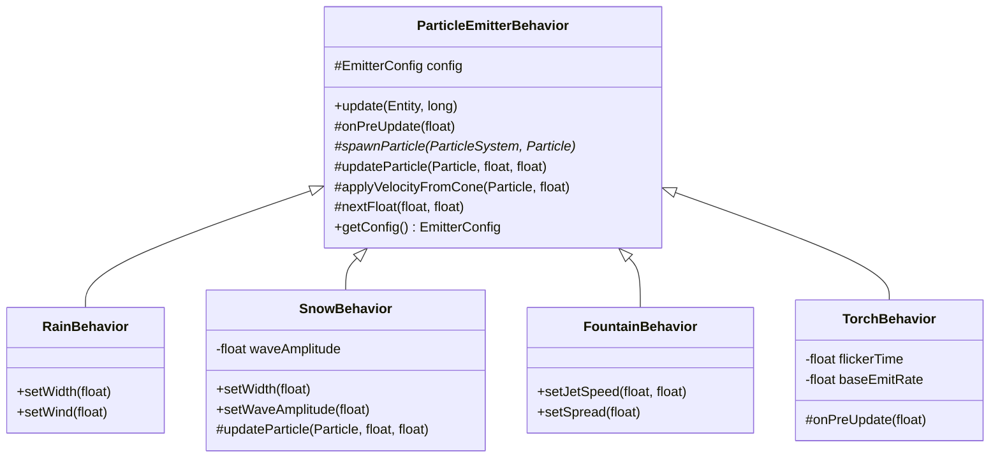

# 13 — ParticleSystem

> **Packages** : `com.core.entity` · `com.core.behavior.particle` · `com.core.gfx.plugin`  
> **Fichiers clés** : `Particle.java` · `ParticleSystem.java` · `EmitterConfig.java` · `ParticleEmitterBehavior.java` · `RainBehavior.java` · `SnowBehavior.java` · `FountainBehavior.java` · `TorchBehavior.java` · `ParticleSystemRenderer.java`

---

## 13.1 Vue d'ensemble

Un `ParticleSystem` est une **entité légère** qui émet en continu un flux de `Particle` et délègue toute la logique de simulation à un ou plusieurs `ParticleEmitterBehavior`.


Points clés de conception :

| Décision | Justification |
|---|---|
| `physicsType = STATIC` | Le moteur appelle `entity.update()` chaque frame (déclenchant les behaviors) sans appliquer gravité ni collision sur l'émetteur lui-même. |
| `width = height = 0` | AABB nulle → le `CollisionEngine` ignore entièrement l'entité. |
| Pool de `Particle` plat (`ArrayList`) | Évite la pression GC : les particules mortes (`alive=false`) sont recyclées via `findDeadSlot()` avant d'allouer un nouvel objet. |
| `EmitterConfig` séparé | Le Level Editor peut lire/écrire les champs directement ; les behaviors ne couplent pas leur logique au panneau d'édition. |

---

## 13.2 Classe `Particle`

Objet de données pur, sans héritage. Tous les champs sont `public float` pour la performance (pas d'appels get/set dans la boucle chaude).

```java
public float x, y;            // position
public float vx, vy;          // vélocité
public float life, maxLife;   // durée de vie restante / totale (secondes)
public float size, initialSize;
public float rotation;        // angle ou phase sinusoïdale (réutilisé par Snow)
public float angularVelocity; // vitesse angulaire ou fréquence de vague
public float alpha;           // [0,1] opacité courante
public Color color;
public float data;            // champ libre par-behavior (ex. phase d'offset Snow)
public boolean alive;
```

`reset()` remet tous les champs à leur valeur neutre et positionne `alive = false`.

---

## 13.3 Classe `ParticleSystem`

```java
public class ParticleSystem extends Entity<ParticleSystem>
```

| Champ / méthode | Description |
|---|---|
| `int maxParticles` | Nombre maximal de particules simultanées (défaut : 200). |
| `List<Particle> particles` | Pool plat — jamais trié, jamais vidé hors `clearParticles()`. |
| `setMaxParticles(int)` | Fluent ; clampe à ≥ 1. |
| `aliveCount()` | Compte `alive=true` dans le pool. |
| `clearParticles()` | Marque toutes les particules mortes (ex. reset de scène). |

---

## 13.4 Classe `EmitterConfig`

Contient la totalité des paramètres de l'émetteur.

| Paramètre | Type | Défaut | Description |
|---|---|---|---|
| `emitRate` | `float` | `60` | Particules émises par seconde. |
| `minLife` / `maxLife` | `float` | `1` / `3` | Durée de vie min / max (s). |
| `direction` | `float` | `−π/2` | Direction centrale (radians, 0=droite, −π/2=haut). |
| `spread` | `float` | `0.3` | Demi-angle du cône (radians). |
| `minSpeed` / `maxSpeed` | `float` | `50` / `150` | Vitesse initiale (px/s). |
| `minSize` / `maxSize` | `float` | `3` / `8` | Taille initiale (px). |
| `emitAreaW` / `emitAreaH` | `float` | `0` / `0` | Zone de spawn aléatoire autour de l'origine. |
| `gravityFactor` | `float` | `0` | Facteur appliqué à la gravité monde (1 = normale, −0.25 = flottabilité). |
| `windX` / `windY` | `float` | `0` / `0` | Accélération additionnelle (vent). |
| `worldGravityX/Y` | `float` | `0` | Synchronisé depuis `World` chaque frame. |
| `startColor` / `endColor` | `Color` | — | Interpolation linéaire couleur par `interpolateColor(ratio)`. |
| `fadeOut` | `boolean` | `true` | Réduit `alpha` proportionnellement à l'âge. |
| `shrink` | `boolean` | `false` | Réduit `size` vers 0 en fin de vie. |
| `shape` | `ParticleShape` | `CIRCLE` | Forme rendue (`CIRCLE`, `LINE`, `SQUARE`). |

---

## 13.5 Classe abstraite `ParticleEmitterBehavior`

```
ParticleEmitterBehavior  implements Behavior
  │
  ├── update(entity, elapsed)           ← appel depuis entity.update()
  │     ├── onPreUpdate(dt)             ← hook (ex. flicker TorchBehavior)
  │     ├── updateParticles(ps, dt)
  │     │     └── updateParticle(p, dt, ratio)  ← hook per-particle
  │     └── spawnParticles(ps, dt)
  │
  └── spawnParticle(ps, p)              ← abstract
```

### Diagramme de classes



---

## 13.6 Behaviors concrètes


### 13.6.1 `RainBehavior`

| Paramètre | Valeur par défaut |
|---|---|
| `emitRate` | 150 p/s |
| `direction` | π/2 (↓) |
| `spread` | 0.05 rad (quasi-vertical) |
| `speed` | 250–450 px/s |
| `shape` | `LINE` (streak vertical) |
| Helpers | `setWidth(float)`, `setWind(float)` |

### 13.6.2 `SnowBehavior`

- Drift sinusoïdal horizontal : `p.rotation` accumule la phase (rad), `p.angularVelocity` la fréquence.  
- `updateParticle()` override : `p.vx = sin(p.rotation) * waveAmplitude`.  
- `gravityFactor = 0.05` → chute lente et flottante.

### 13.6.3 `FountainBehavior`

- `direction = −π/2` (↑), `gravityFactor = 1.0` → trajectoire parabolique.  
- `setJetSpeed(min, max)` contrôle la hauteur du jet.

### 13.6.4 `TorchBehavior`

- `gravityFactor = −0.25` → flottabilité des flammes.  
- `shrink = true` : les particules rapetissent en mourant.  
- Flicker : `onPreUpdate()` module `emitRate` via la somme de deux sinus de fréquences différentes.

---

## 13.7 Cycle de vie d'une particule


1. **SPAWN** — `spawnParticle()` initialise position, vélocité, taille, couleur.  
2. **UPDATE** — chaque frame : intégration forces → position → angle → état visuel → hook `updateParticle()`.  
3. **DIE** — `life ≤ 0` → `alive = false`.  
4. **RECYCLE** — `findDeadSlot()` retourne le slot pour la prochaine émission (pas de `new Particle()`).

---

## 13.8 `ParticleSystemRenderer`

Implémente `EntityRenderer<ParticleSystem>` ; enregistré en tête de liste des plugins du `Renderer`.

```java
renderer.registerPlugin(new ParticleSystemRenderer());
```

| Shape | Dessin |
|---|---|
| `CIRCLE` | `g.fillOval(px-r, py-r, d, d)` |
| `LINE`   | `g.drawLine(px, py, px, py+size*3)` (streak pluie) |
| `SQUARE` | `g.fillRect(px-r, py-r, d, d)` |

`AlphaComposite.SRC_OVER` est appliqué avec `p.alpha` pour chaque particule ; la composite et le stroke d'origine sont restaurés après le rendu.

---

## 13.9 Plugin éditeur

Voir le [chapitre 14 (spec-editor)](../reqs/spec-editor.md) et son **Annexe A** pour l'intégration complète via `EditorPlugin` / `ParticleSystemEditorPlugin`.

Interface clé :

```java
public interface EditorPlugin {
    String getName();
    List<Class<? extends Behavior>> getBehaviors();
    List<Class<? extends Entity<?>>> getEntityTypes();
    List<EntityRenderer<?>> getRenderers();
    Class<?> getPropertiesPanelClass(Class<?> entityClass);
    void onEditorInit(Object editorApp);
}
```

`@BehaviorParam` annote les paramètres constructeurs des behaviors pour que l'éditeur génère les formulaires dynamiquement.


---

## 13.10 Intégration dans une scène

```java
@Override
public void create() {
    // 1. Enregistrer le renderer une seule fois par scène (ou dans la config app)
    app.getRenderer().registerPlugin(new ParticleSystemRenderer());

    // 2. Créer un ParticleSystem pluie
    World world = getWorld();
    ParticleSystem rain = new ParticleSystem("rain")
        .setPosition(600, -10)
        .setMaxParticles(500)
        .addBehavior(new RainBehavior(world).setWidth(1200));
    add(rain);

    // 3. Torche en position fixe
    ParticleSystem torch = new ParticleSystem("torch")
        .setPosition(300, 560)
        .setMaxParticles(100)
        .addBehavior(new TorchBehavior());
    add(torch);
}
```

---

## 13.11 Performance et bonnes pratiques

| Recommandation | Raison |
|---|---|
| Limiter `maxParticles` à ≤ 600 par système | Au-delà, le rendu pixel-by-pixel devient le goulot. |
| Partager un `EmitterConfig` entre comportements similaires | Réduit la mémoire et simplifie l'édition. |
| Ne pas appeler `clearParticles()` en boucle chaude | Peut provoquer des pics si le pool est grand ; préférer `setActive(false)`. |
| Utiliser `setActive(false)` hors champ | Le behavior vérifie `ps.isActive()` en entrée de `update()` et sort immédiatement. |
| `emitAreaW / emitAreaH = 0` pour un effet ponctuel | La zone de spawn nulle place toutes les particules exactement à `(ps.x, ps.y)`. |
